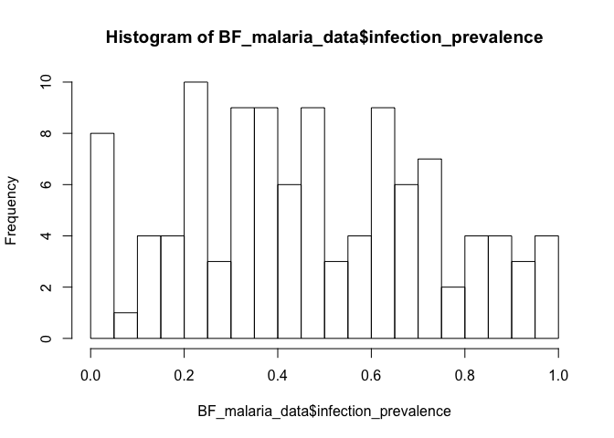
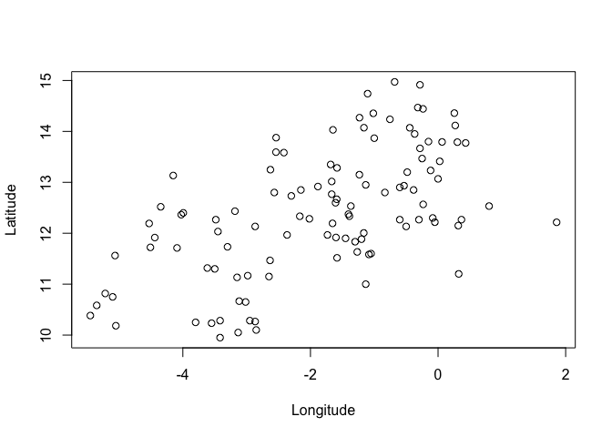
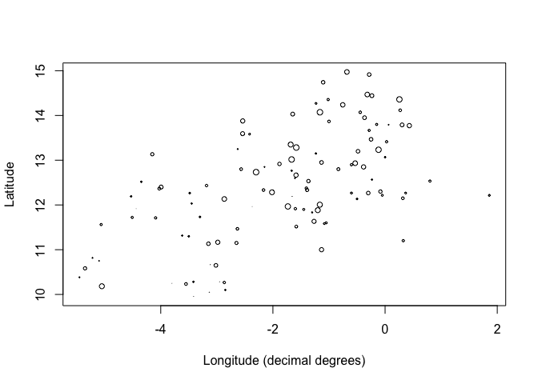

Week 1 - visualizing spatial data
---------------------------------

Welcome to week 1 of spatial analysis for public health. This week we will be learning about the process of moving from visualizing spatial data through to exploration and analysis. We will get our hands dirty with some R code and learn how to make beautiful maps.

This week's [lecture]() will focus on some of the concepts behind spatial epidemiology. I will then walk you through some R code to load and visualize spatial data in [this video](). You will then have a chance to apply that code to new data and questions in this week's [assignment]().

As ever, post any questions on the b-courses piazza and if you are still having issues, join us on 1 of the office hour sessions where we can walk you through any challenges you are having.

Good luck!


Lab 1: Working with Spatial Data in R
-------------------------------------

The simplest data is a table with coordinates (i.e. point data). For this assignment, we'll work with malaria prevalence point data from Burkina Faso.

Import the data

``` r
BF_malaria_data <- read.csv("https://raw.githubusercontent.com/HughSt/HughSt.github.io/master/course_materials/week1/Lab_files/Data/BF_malaria_data.csv",
                            header=T)
```

The columns should be self-explanatory, but briefly: - examined = numbers tested - positives = of those tested, how many were positive for malaria - longitude = longitude in decimal degrees - latitude = latitude in decimal degrees

``` r
head(BF_malaria_data) # gives you the first few rows
```

    ##   X examined positives longitude latitude
    ## 1 1      998       153  -5.45000 10.38333
    ## 2 2      459       262  -5.35000 10.58333
    ## 3 3      595        72  -5.21667 10.81667
    ## 4 4      883        81  -5.10000 10.75000
    ## 5 5      456       170  -5.06270 11.56180
    ## 6 6      304       264  -5.05000 10.18333

``` r
names(BF_malaria_data) # gives you the column names
```

    ## [1] "X"         "examined"  "positives" "longitude" "latitude"

``` r
# If you want to create a new variable, you can use the $ sign
#Example: Prevalence
BF_malaria_data$infection_prevalence <- BF_malaria_data$positives / BF_malaria_data$examined

#Create a histogram of the prevalence
hist(BF_malaria_data$infection_prevalence, breaks=20)
```



``` r
# Use R's basic plotting function to plot 
plot(BF_malaria_data$longitude, BF_malaria_data$latitude,
     ylab = "Latitude", xlab="Longitude") #boring!
```



``` r
# Use the cex function to plot circle size as a function of a variable
plot(BF_malaria_data$longitude, BF_malaria_data$latitude, 
     cex=BF_malaria_data$infection_prevalence,
     ylab = "Latitude", xlab="Longitude (decimal degrees)")
```




Resources
---------

The R packages [sp](https://cran.r-project.org/web/packages/sp/index.html) and [raster](https://cran.r-project.org/web/packages/raster/index.html) are both important packages for spatial analysis.

R studio also have a fantastic [site](https://rstudio.github.io/leaflet/) outlining the use of leaflet

