Week 5 - Accessing spatial datasets
================

------------------------------------------------------------------------

------------------------------------------------------------------------

1. Introduction
===============

##### *Welcoming quizz: Remember that figure? Tell me more about it!*


------------------------------------------------------------------------

### Putting it (Epi 264) all together

Last week, we spoke about cluster analysis (week 4) to reveal noteworthy spatial patterns in the outcome data (health related events/measures) and ways to assess spatial autocorrelation. In week 3 (Spatial variation in risk), we actually kind of already used spatial autocorrelation to interpolate the data and produce smooth maps of our outcomes.

Starting next week and till the end of the class, we will talk about spatial regression modeling which combines regression modeling (first trend) and spatial autocorrelation modeling (second trend).

Today, in this transition session, we will cover some of the spatial data you can use in the regression modeling step.

------------------------------------------------------------------------

------------------------------------------------------------------------

2. Accessing spatial data
=========================

Many spatial data have been made directly available within R thanks to packages but for some data, you might need to look online.

------------------------------------------------------------------------

### **From R packages**

``` r
# Load packages
library(raster)
library(leaflet)
```

You have already used spatial data from the "raster" package via the getData function. Let's see what's in there!

``` r
# Read vignette for details and references
?raster::getData()
```

So you can download administrative boundaries (option name = 'GADM'), elevation (name = 'alt') and even climate variables (name = 'worldclim').

``` r
## Ethiopia
# Administrative boundaries (level 1)
ETH_Adm_1 <- raster::getData(name = "GADM",
                             country = "ETH",
                             level = 1)

leaflet() %>% # Plot
  addProviderTiles("CartoDB.Positron") %>%
  addPolygons(data = ETH_Adm_1,
              popup = ETH_Adm_1$NAME_1,
              label = ETH_Adm_1$NAME_1)
```

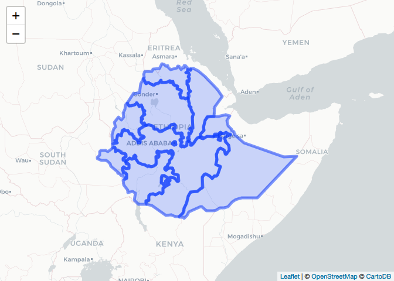

``` r
# Elevation (meters)
ETH_elev <- raster::getData(name = "alt",
                            country = "ETH")

raster_colorPal_elev <- colorNumeric(palette = topo.colors(64),
                                     domain = values(ETH_elev),
                                     na.color = NA) # Define palette
leaflet() %>% # Plot
  addProviderTiles("CartoDB.Positron") %>%
  addRasterImage(x = ETH_elev,
                 color = raster_colorPal_elev) %>%
  addLegend(title = "Elevation<br>(meters)",
            values = values(ETH_elev),
            pal = raster_colorPal_elev) 
```

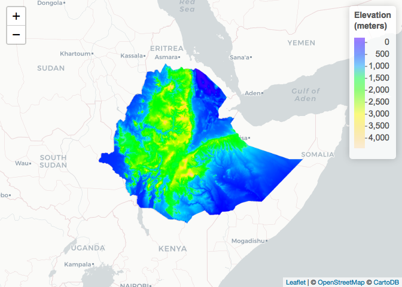

------------------------------------------------------------------------

### **Make sure you get what you want**

Need to correctly specify 'country' option:

``` r
raster::getData('ISO3')
```

Varying 'level' option gives you different administrative boundaries and disabling 'mask' option reveals elevation data comes from a larger surface that goes beyond the country's boundaries:

``` r
## Ethiopia and South Sudan
# Administrative boundaries (level 0)
SSD_Adm_0 <- raster::getData(name = "GADM",
                             country = "SSD",
                             level = 0)

# Elevation (meters)
ETH_elev_unmasked <- raster::getData(name = "alt",
                                     country = "ETH",
                                     mask = FALSE)

raster_colorPal_elev_unmasked <- colorNumeric(palette = topo.colors(64),
                                              domain = values(ETH_elev_unmasked),
                                              na.color = NA) # Define palette
leaflet() %>% # Plot
  addProviderTiles("CartoDB.Positron") %>%
  addPolygons(data = SSD_Adm_0,
              popup = SSD_Adm_0$NAME_0,
              label = SSD_Adm_0$NAME_0,
              fillOpacity = 0,
              color = "red",
              weight = 3) %>%
  addRasterImage(x = ETH_elev_unmasked,
                 color = raster_colorPal_elev_unmasked) %>%
  addLegend(title = "Elevation<br>(meters)",
            values = values(ETH_elev_unmasked),
            pal = raster_colorPal_elev_unmasked) 
```

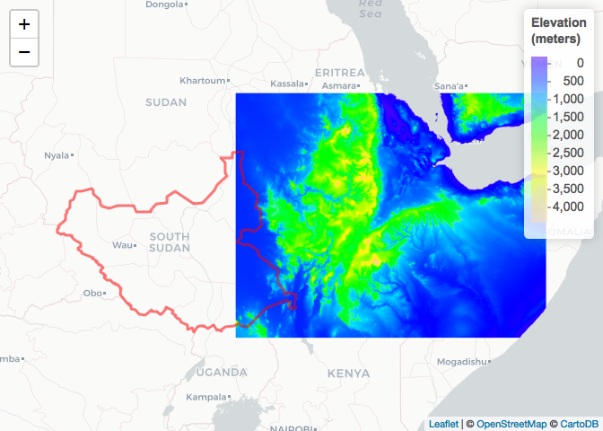

As you vary the 'name' option to access environmental variable, pay particular attention to the geolocalisation options. For instance, at the 2.5 resolution (minutes of a degree), there is no need for location specification but at the 0.5 resolution, need to provide 'lon' and 'lat' arguments...

``` r
# Precipitation from worldclim at the 2.5, 5 or 10 resolution (minutes of a degree)... no need for location specification?!?!
ETH_prec_10 <- raster::getData(name = "worldclim",
                            var = "prec",
                            res = 10)

# Precipitation from worldclim at the 0.5 resolution (minutes of a degree)... need to specifiy 'lon' and 'lat' of the tile looked for
ETH_prec_0.5 <- raster::getData(name = "worldclim",
                            var = "prec",
                            res = 0.5,
                            lon = 40,
                            lat = 10)
```

##### *Pop quiz: why do you think that is?*

``` r
# Explore objects
ETH_prec_10
```

    ## class      : RasterStack 
    ## dimensions : 900, 2160, 1944000, 12  (nrow, ncol, ncell, nlayers)
    ## resolution : 0.1666667, 0.1666667  (x, y)
    ## extent     : -180, 180, -60, 90  (xmin, xmax, ymin, ymax)
    ## crs        : +proj=longlat +datum=WGS84 +ellps=WGS84 +towgs84=0,0,0 
    ## names      : prec1, prec2, prec3, prec4, prec5, prec6, prec7, prec8, prec9, prec10, prec11, prec12 
    ## min values :     0,     0,     0,     0,     0,     0,     0,     0,     0,      0,      0,      0 
    ## max values :   885,   736,   719,   820,   955,  1850,  2088,  1386,   904,    980,    893,    914

``` r
ETH_prec_0.5
```

    ## class      : RasterStack 
    ## dimensions : 3600, 3600, 12960000, 12  (nrow, ncol, ncell, nlayers)
    ## resolution : 0.008333333, 0.008333333  (x, y)
    ## extent     : 30, 60, 0, 30  (xmin, xmax, ymin, ymax)
    ## crs        : +proj=longlat +datum=WGS84 +ellps=WGS84 +towgs84=0,0,0 
    ## names      : prec1_27, prec2_27, prec3_27, prec4_27, prec5_27, prec6_27, prec7_27, prec8_27, prec9_27, prec10_27, prec11_27, prec12_27 
    ## min values :        0,        0,        0,        0,        0,        0,        0,        0,        0,         0,         0,         0 
    ## max values :      126,      137,      240,      697,      289,      360,      458,      457,      340,       450,       584,       184

``` r
# Restrict to October and plot
ETH_prec_10_Oct <- ETH_prec_10[[10]]
ETH_prec_0.5_Oct <- ETH_prec_0.5[[10]]


raster_colorPal_prec <- colorNumeric(palette = topo.colors(64),
                                     domain = values(ETH_prec_10_Oct),
                                     na.color = NA) # Define palette

leaflet() %>% # Plot
  addProviderTiles("CartoDB.Positron") %>%
  addRasterImage(x = ETH_prec_10_Oct,
                 color = raster_colorPal_prec,
                 group = "October precipitation (mm)") %>%
  addLegend(title = "October precipitation (mm)<br>(10' res)",
            values = values(ETH_prec_10_Oct),
            pal = raster_colorPal_prec)  %>%
  addLayersControl(overlayGroups = c("October precipitation (mm)"))
```

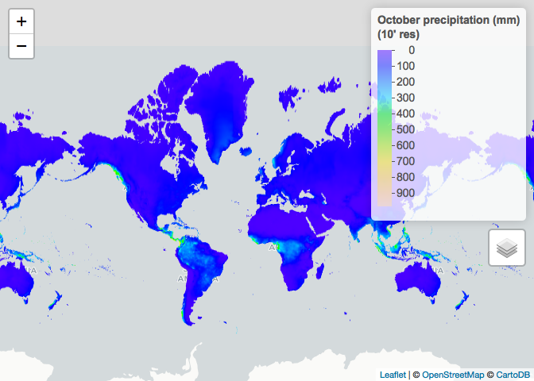

``` r
leaflet() %>% # Plot
  addProviderTiles("CartoDB.Positron") %>%
  addPolygons(data = SSD_Adm_0,
              popup = SSD_Adm_0$NAME_0,
              label = SSD_Adm_0$NAME_0,
              fillOpacity = 0,
              color = "red",
              weight = 3,
              group = "South Sudan") %>%
  addPolygons(data = ETH_Adm_1,
              popup = ETH_Adm_1$NAME_1,
              label = ETH_Adm_1$NAME_1,
              fillOpacity = 0,
              color = "black",
              weight = 3,
              group = "Ethiopia") %>%
  addRasterImage(x = ETH_prec_0.5_Oct,
                 color = raster_colorPal_prec,
                 group = "October precipitation (mm)") %>%
  addLegend(title = "October precipitation (mm)<br>(0.5' res)",
            values = values(ETH_prec_0.5_Oct),
            pal = raster_colorPal_prec) %>%
  addLayersControl(overlayGroups = c("October precipitation (mm)", "Ethiopia", "South Sudan")) %>%
  hideGroup("South Sudan")
```

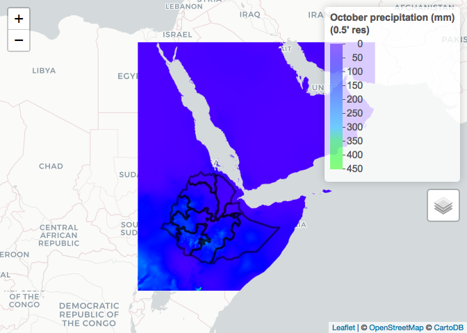

##### *Pop quiz: how would you get the 0.5 resolution October precipitation for South Sudan?*

``` r
# Precipitation from worldclim at the 0.5 resolution (minutes of a degree)... Left half of South Sudan
SSD_prec_0.5_left <- raster::getData(name = "worldclim",
                                     var = "prec",
                                     res = 0.5,
                                     lon = 20,
                                     lat = 10)

# Restrict to October
SSD_prec_0.5_Oct_left <- SSD_prec_0.5_left[[10]]

# Merge left and right halves together
SSD_prec_0.5_Oct <- raster::merge(x = SSD_prec_0.5_Oct_left,
                                  y = ETH_prec_0.5_Oct)

# Crop to South Sudan extent 
SSD_prec_0.5_Oct_Crop_Unmasked <- raster::crop(x = SSD_prec_0.5_Oct,
                                               y = SSD_Adm_0)

# Mask to South Sudan and plot
SSD_prec_0.5_Oct_Crop <- raster::mask(x = SSD_prec_0.5_Oct_Crop_Unmasked,
                                      mask = SSD_Adm_0)

raster_colorPal_prec_SSD <- colorNumeric(palette = topo.colors(64),
                                         domain = values(SSD_prec_0.5_Oct_Crop),
                                         na.color = NA) # Define palette

leaflet() %>% # Plot
  addProviderTiles("CartoDB.Positron") %>%
  addRasterImage(x = SSD_prec_0.5_Oct_Crop,
                 color = raster_colorPal_prec_SSD) %>%
  addPolygons(data = SSD_Adm_0,
              popup = SSD_Adm_0$NAME_0,
              label = SSD_Adm_0$NAME_0,
              fillOpacity = 0,
              color = "red",
              weight = 3) %>%
  addLegend(title = "October precipitation (mm)<br>(0.5' res)",
            values = values(SSD_prec_0.5_Oct_Crop),
            pal = raster_colorPal_prec_SSD)
```

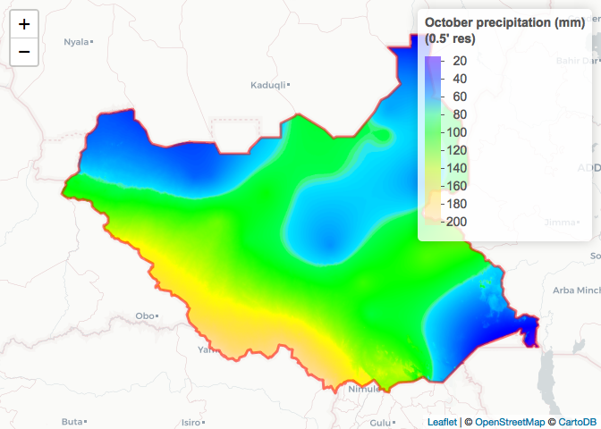

##### *In class assignement: map the 1 (minute of a degree) resolution January precipitation for Kenya in inches?*

------------------------------------------------------------------------

### **Other R packages**

Here are a few R packages with spatial data available:

-   raster
-   [getSpatialData](https://github.com/16EAGLE/getSpatialData)
-   rgistools
-   rstoolbox
-   sentinel2
-   MODIS

------------------------------------------------------------------------

### **Online**

Often times those R packages simply get you an easier access to data hosted online by various research groups and can have useful additional functions to process the data. Sometimes though, no one has put the effort to package the data you are looking for or you might not know that it is already available in R. In those cases, you end up needing to download the data online (which can come in many different formats) and import in R yourself.

Download the precipitation WorldClim variable at 10' resolution available [here](http://worldclim.org/version2). What you get is a folder with 12 *.tif* files, presumably representing monthly precipitation (in mm and averaged over the 1970-2000 period), presumably over the entire globe. As you encounter new file formats that you don't know how to import in R, it's good practice to scout forums. Let's google [How to import .tif files in R?](https://www.google.com/search?client=safari&rls=en&q=How+to+import+.tif+files+in+R&ie=UTF-8&oe=UTF-8) and find our answer on that [post](https://stackoverflow.com/questions/16803503/reading-a-tif-file-in-r). Fortunately, it looks like the raster function of the 'raster' package reads in *.tif* files.

``` r
# Path to wc2 folder you just downloaded
path_to_wc2_folder <- "/Users/francoisrerolle/Downloads"

# List files in folder downloaded
list.files(path = paste0(path_to_wc2_folder, "/wc2"))
```

    ##  [1] "readme.txt"            "wc2.0_10m_prec_01.tif"
    ##  [3] "wc2.0_10m_prec_02.tif" "wc2.0_10m_prec_03.tif"
    ##  [5] "wc2.0_10m_prec_04.tif" "wc2.0_10m_prec_05.tif"
    ##  [7] "wc2.0_10m_prec_06.tif" "wc2.0_10m_prec_07.tif"
    ##  [9] "wc2.0_10m_prec_08.tif" "wc2.0_10m_prec_09.tif"
    ## [11] "wc2.0_10m_prec_10.tif" "wc2.0_10m_prec_11.tif"
    ## [13] "wc2.0_10m_prec_12.tif"

``` r
list.files(path = paste0(path_to_wc2_folder, "/wc2"), pattern = ".tif") # Restrict to .tif files
```

    ##  [1] "wc2.0_10m_prec_01.tif" "wc2.0_10m_prec_02.tif"
    ##  [3] "wc2.0_10m_prec_03.tif" "wc2.0_10m_prec_04.tif"
    ##  [5] "wc2.0_10m_prec_05.tif" "wc2.0_10m_prec_06.tif"
    ##  [7] "wc2.0_10m_prec_07.tif" "wc2.0_10m_prec_08.tif"
    ##  [9] "wc2.0_10m_prec_09.tif" "wc2.0_10m_prec_10.tif"
    ## [11] "wc2.0_10m_prec_11.tif" "wc2.0_10m_prec_12.tif"

``` r
# Read in October precipitation
wc2_prec_10_Oct <- raster::raster(x = paste0(path_to_wc2_folder, "/wc2/wc2.0_10m_prec_10.tif"))

# Compare to data downloaded via raster::getData()
wc2_prec_10_Oct
```

    ## class      : RasterLayer 
    ## dimensions : 1080, 2160, 2332800  (nrow, ncol, ncell)
    ## resolution : 0.1666667, 0.1666667  (x, y)
    ## extent     : -180, 180, -90, 90  (xmin, xmax, ymin, ymax)
    ## crs        : +proj=longlat +datum=WGS84 +no_defs +ellps=WGS84 +towgs84=0,0,0 
    ## source     : /Users/francoisrerolle/Downloads/wc2/wc2.0_10m_prec_10.tif 
    ## names      : wc2.0_10m_prec_10 
    ## values     : 0, 2328  (min, max)

``` r
ETH_prec_10_Oct
```

    ## class      : RasterLayer 
    ## dimensions : 900, 2160, 1944000  (nrow, ncol, ncell)
    ## resolution : 0.1666667, 0.1666667  (x, y)
    ## extent     : -180, 180, -60, 90  (xmin, xmax, ymin, ymax)
    ## crs        : +proj=longlat +datum=WGS84 +ellps=WGS84 +towgs84=0,0,0 
    ## source     : /Users/francoisrerolle/Desktop/wc10/prec10.bil 
    ## names      : prec10 
    ## values     : 0, 980  (min, max)

``` r
leaflet() %>% # Plot
  addProviderTiles("CartoDB.Positron") %>%
  addRasterImage(x = ETH_prec_10_Oct,
                 color = raster_colorPal_prec,
                 group = "raster::getData") %>%
  addRasterImage(x = wc2_prec_10_Oct,
                 color = raster_colorPal_prec,
                 group = "WorldClim.com download") %>%
  addLegend(title = "October precipitation (mm)<br>(10' res)",
            values = values(ETH_prec_10_Oct),
            pal = raster_colorPal_prec) %>%
  addLayersControl(overlayGroups = c("raster::getData", "WorldClim.com download")) %>%
  hideGroup("WorldClim.com download")
```

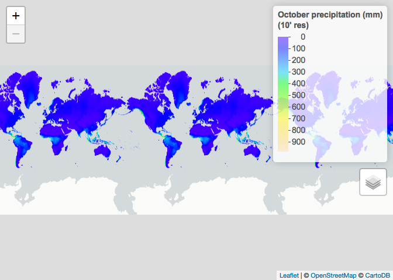

``` r
# Another more elegant way to read in the data downloaded online
wc2_prec_10 <- raster::stack(x = paste0(path_to_wc2_folder, "/wc2/", list.files(path = paste0(path_to_wc2_folder, "/wc2"), pattern = ".tif")))
wc2_prec_10
```

    ## class      : RasterStack 
    ## dimensions : 1080, 2160, 2332800, 12  (nrow, ncol, ncell, nlayers)
    ## resolution : 0.1666667, 0.1666667  (x, y)
    ## extent     : -180, 180, -90, 90  (xmin, xmax, ymin, ymax)
    ## crs        : +proj=longlat +datum=WGS84 +no_defs +ellps=WGS84 +towgs84=0,0,0 
    ## names      : wc2.0_10m_prec_01, wc2.0_10m_prec_02, wc2.0_10m_prec_03, wc2.0_10m_prec_04, wc2.0_10m_prec_05, wc2.0_10m_prec_06, wc2.0_10m_prec_07, wc2.0_10m_prec_08, wc2.0_10m_prec_09, wc2.0_10m_prec_10, wc2.0_10m_prec_11, wc2.0_10m_prec_12 
    ## min values :                 0,                 0,                 0,                 0,                 0,                 0,                 0,                 0,                 0,                 0,                 0,                 0 
    ## max values :               908,               793,               720,              1004,              2068,              2210,              2381,              1674,              1955,              2328,               718,               806

``` r
wc2_prec_10[[10]]
```

    ## class      : RasterLayer 
    ## dimensions : 1080, 2160, 2332800  (nrow, ncol, ncell)
    ## resolution : 0.1666667, 0.1666667  (x, y)
    ## extent     : -180, 180, -90, 90  (xmin, xmax, ymin, ymax)
    ## crs        : +proj=longlat +datum=WGS84 +no_defs +ellps=WGS84 +towgs84=0,0,0 
    ## source     : /Users/francoisrerolle/Downloads/wc2/wc2.0_10m_prec_10.tif 
    ## names      : wc2.0_10m_prec_10 
    ## values     : 0, 2328  (min, max)

For instance, for my first dissertation paper, I was looking for deforestation data. I was familiar with the work from Hansen et al. [High-Resolution Global Maps of 21st-Century Forest Cover Change](https://science.sciencemag.org/content/342/6160/850) and there associated [website](https://earthenginepartners.appspot.com/science-2013-global-forest/download_v1.2.html). To download deforestation data over Lao PDR, you have to pick the appropriate tile (s), download, import and process in R.


After reading the author's paper, supplementary materials and website instructions several times, I still couldn't make sense of their data. I eventually found a R package [gfcanalysis](http://azvoleff.com/articles/analyzing-forest-change-with-gfcanalysis/) designed specifically to analyze this dataset and started believing again! Althought it greatly helped me understand the raw data, I ended up not using the package because of simplifying assumptions they were making about the data.

##### *In class assignement: download Open Street Map data and plot main roads in Laos*

### **Other online resources**

Here are a few good websites with free downloadable spatial data

-   [Worldclim](http://worldclim.org/version2)
-   [CHIRPS](https://www.chc.ucsb.edu/data/chirps)
-   [Google Earth Engine](https://earthengine.google.com)
-   [Climate Engine](https://climateengine.org)
-   [Copernicus Land data](https://land.copernicus.eu)
-   [Malaria Atlas Project](https://map.ox.ac.uk)
-   [MODIS](https://modis.gsfc.nasa.gov)

------------------------------------------------------------------------

------------------------------------------------------------------------

2. Spatial data: where do they come from?
=========================================

### **Welcoming quizzes**

##### *Pop quiz: how do you think the precipitation surface was produced?*

Answer [here](https://www.chc.ucsb.edu/data/chirps).

##### *Pop quiz: how do you think the altitude surface was produced?*

Answer [here](https://gisgeography.com/srtm-shuttle-radar-topography-mission/).

Now, remember the land use data from Burkina Faso and the water body data from Ethiopia, used in week 2?

##### *Pop quiz: how do you think those surfaces were produced?*

``` r
# Land use (# For information on land use classifications see http://due.esrin.esa.int/files/GLOBCOVER2009_Validation_Report_2.2.pdf)
ETH_land_use <- raster::raster("https://github.com/HughSt/HughSt.github.io/blob/master/course_materials/week2/Lab_files/ETH_land_use.tif?raw=true")
plot(ETH_land_use)
```

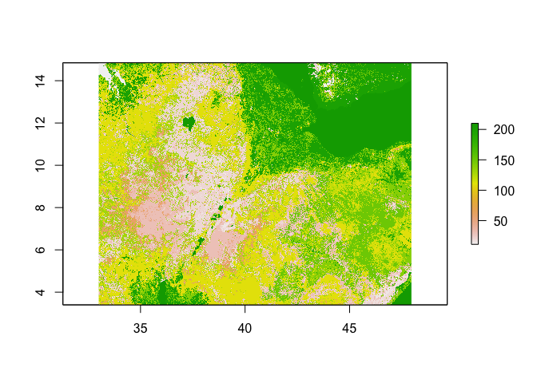


``` r
waterbodies <- rgdal::readOGR("https://raw.githubusercontent.com/HughSt/HughSt.github.io/master/course_materials/week2/Lab_files/ETH_waterbodies.geojson")
```

    ## OGR data source with driver: GeoJSON 
    ## Source: "https://raw.githubusercontent.com/HughSt/HughSt.github.io/master/course_materials/week2/Lab_files/ETH_waterbodies.geojson", layer: "OGRGeoJSON"
    ## with 380 features
    ## It has 5 fields

``` r
leaflet() %>% # Plot
  addProviderTiles("CartoDB.Positron") %>%
  addPolylines(data = waterbodies)
```

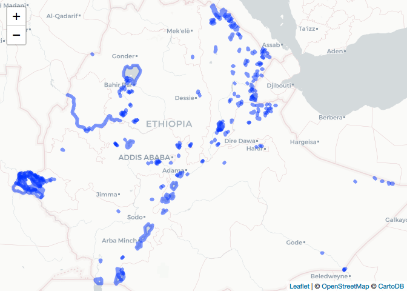

------------------------------------------------------------------------

### **Remote sensing data**


Satellites orbiting around the globe carry instruments to take measurements. Just likes our eyes or cameras, the sensors onboard satellites receive a radiation that was emitted by a source of light (sun, flash, light bulb, etc...) and reflected by an object. The differences between the pre and post reflection radiations characterize properties of the reflecting object such as color for which our eyes have been optimized to perceive. You can picture the radiation as a wave signal. Speed radars and the SRTM mission act in the same way (except they also send the incident radiation) and from the difference in the 2 wave signals calculate speed and elevation respectively.

Speed, elevation, color are calculated based on the wavelengths property of the wave. Sensors onboard remote sensing satelitte mission can receive multiple waves across the spectrum.


For instance the satellite Landsat-8 has 11 bands (i.e wavelengths ranges) at which it measures the reflectance (fraction of incident electromagnetic power that is reflected) which we can simply see as a measure of 'light' intensity reflected by the earth surface.

``` r
# Load some Etiophia Landsat data for the year 2017 (only 7 first bands available)
Landsat_Band_1 <- raster::raster(x = "https://raw.githubusercontent.com/HughSt/HughSt.github.io/master/course_materials/week5/Lab_files/Landsat/Landsat_2017_Band1.tif")
Landsat_Band_2 <- raster::raster(x = "https://raw.githubusercontent.com/HughSt/HughSt.github.io/master/course_materials/week5/Lab_files/Landsat/Landsat_2017_Band2.tif")
Landsat_Band_3 <- raster::raster(x = "https://raw.githubusercontent.com/HughSt/HughSt.github.io/master/course_materials/week5/Lab_files/Landsat/Landsat_2017_Band3.tif")
Landsat_Band_4 <- raster::raster(x = "https://raw.githubusercontent.com/HughSt/HughSt.github.io/master/course_materials/week5/Lab_files/Landsat/Landsat_2017_Band4.tif")
Landsat_Band_5 <- raster::raster(x = "https://raw.githubusercontent.com/HughSt/HughSt.github.io/master/course_materials/week5/Lab_files/Landsat/Landsat_2017_Band5.tif")
Landsat_Band_6 <- raster::raster(x = "https://raw.githubusercontent.com/HughSt/HughSt.github.io/master/course_materials/week5/Lab_files/Landsat/Landsat_2017_Band6.tif")
Landsat_Band_7 <- raster::raster(x = "https://raw.githubusercontent.com/HughSt/HughSt.github.io/master/course_materials/week5/Lab_files/Landsat/Landsat_2017_Band7.tif")

# Stack together layers
Landsat_Band <- raster::stack(Landsat_Band_1,
                              Landsat_Band_2,
                              Landsat_Band_3,
                              Landsat_Band_4,
                              Landsat_Band_5,
                              Landsat_Band_6,
                              Landsat_Band_7)

# Explore the reflectance values. Assume you should normalize by 10000 to get reflectance
summary(Landsat_Band[[1]])
```

    ##         Landsat_2017_Band1
    ## Min.                  11.0
    ## 1st Qu.              338.5
    ## Median               404.0
    ## 3rd Qu.              494.5
    ## Max.                2538.5
    ## NA's                   0.0

------------------------------------------------------------------------

### **How do you get from reflectance to land use surfaces?**

First you can read some [documentation](https://www.usgs.gov/faqs/what-are-best-landsat-spectral-bands-use-my-research?qt-news_science_products=0#qt-news_science_products) about the wavelength ranges covered by band for your satellite.

``` r
# Label bands accordingly
names(Landsat_Band) <- c('Ultra.blue', 'Blue', 'Green', 'Red', 'NIR', 'SWIR1', 'SWIR2')

# Plot individual layers
par(mfrow = c(2,2))
plot(Landsat_Band_2, main = "Blue", col = gray(0:100 / 100))
plot(Landsat_Band_3, main = "Green", col = gray(0:100 / 100))
plot(Landsat_Band_4, main = "Red", col = gray(0:100 / 100))
plot(Landsat_Band_5, main = "NIR", col = gray(0:100 / 100))
```

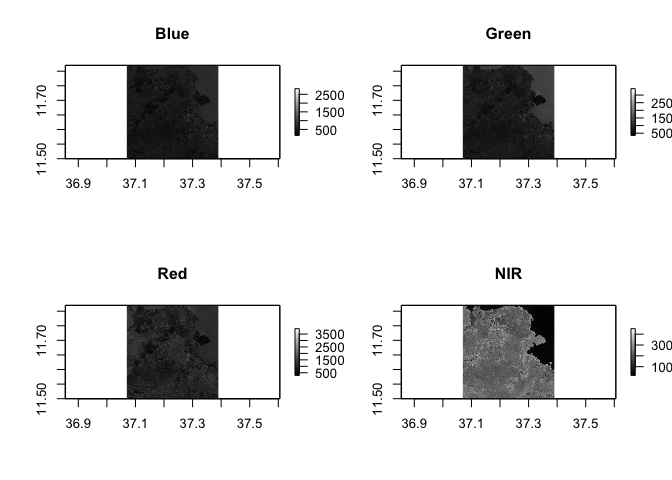

##### *Pop quiz: what do you think is in the top right corner of our spatial extent?*

Notice the difference in shading and range of legends between the different bands. This is because different surface features reflect the incident solar radiation differently. Each layer represent how much incident solar radiation is reflected for a particular wavelength range. For example, vegetation reflects more energy in NIR than other wavelengths and thus appears brighter. In contrast, water absorbs most of the energy in the NIR wavelength and it appears dark.

We do not gain that much information from these grey-scale plots; they are often combined into a “composite” to create more interesting plots. To make a “true (or natural) color” image, that is, something that looks like a normal photograph (vegetation in green, water blue etc), we need bands in the red, green and blue regions. For this Landsat image, band 4 (red), 3 (green), and 2 (blue) can be used. The plotRGB method can be used to combine them into a single composite. You can also supply additional arguments to plotRGB to improve the visualization (e.g. a linear stretch of the values, using strecth = "lin").

``` r
raster::plotRGB(x = Landsat_Band,
                r = 4,
                g = 3,
                b = 2,
                stretch = "lin",
                main = "Landsat True Color Composite")
```

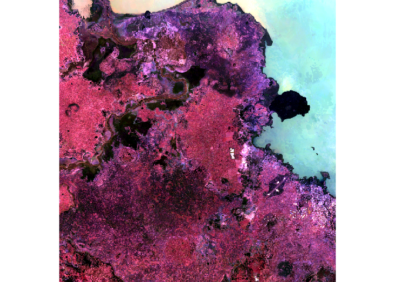

The true-color composite reveals much more about the landscape than the earlier gray images. Another popular image visualization method in remote sensing is known “false color” image in which NIR, red, and green bands are combined. This representation is popular as it makes it easy to see the vegetation (in red).

``` r
raster::plotRGB(x = Landsat_Band,
                r = 5,
                g = 4,
                b = 3,
                stretch = "lin",
                main = "Landsat False Color Composite")
```

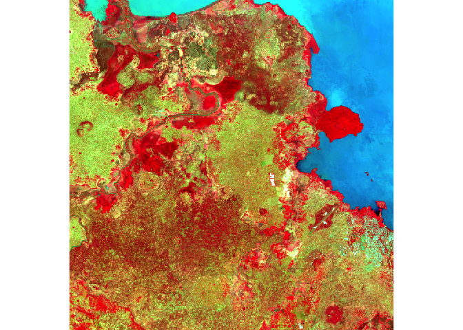

------------------------------------------------------------------------

### **Relation between bands**

A scatterplot matrix can be helpful in exploring relationships between raster layers. This can be done with the pairs() function of the "raster" package.

Plot of reflection in the ultra-blue wavelength against reflection in the blue wavelength.

``` r
raster::pairs(x = Landsat_Band[[1:2]], main = "Ultra-blue versus Blue")
```

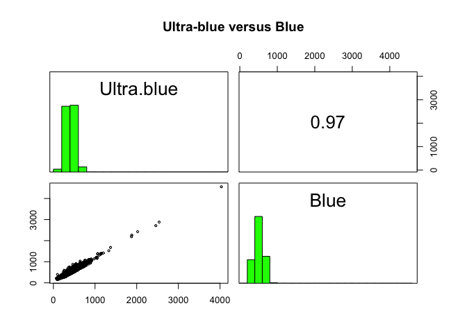

Plot of reflection in the red wavelength against reflection in the NIR wavelength.

``` r
raster::pairs(x = Landsat_Band[[4:5]], main = "Red versus NIR")
```

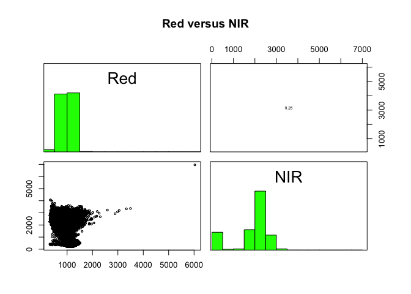

The first plot reveals high correlations between the blue wavelength regions. Because of the high correlation, we can just use one of the blue bands without losing much information. The distribution of points in second plot (between NIR and red) is unique due to its triangular shape. Vegetation reflects more in the NIR range than in the red and creates the upper corner close to NIR (y) axis. Water absorbs energy from all the bands and occupies the location close to origin. The furthest corner is created due to highly reflecting surface features like bright soil or concrete.

------------------------------------------------------------------------

### **Spectral profiles**

A plot of the spectrum (all bands) for pixels representing a certain earth surface features (e.g. water) is known as a spectral profile. Such profiles demonstrate the differences in spectral properties of various earth surface features and constitute the basis for image analysis.

Let's start by loading some training data from the region which compiles GPS coordinates of points for which we know the Land use and Land cover (LULC) class.

``` r
# Load the training dataset, which compiles GPS coordinates of points for which we know the Land use and Land cover (LULC) class
Training_Data <- read.csv(file = "https://raw.githubusercontent.com/HughSt/HughSt.github.io/master/course_materials/week5/Lab_files/LULC_Training_Tana.csv", header = T)

# Explore the data
head(Training_Data)
```

    ##   Latitude Longitude LULC
    ## 1 11.75859  37.26399   12
    ## 2 11.70965  37.14431   12
    ## 3 11.79550  37.38545   17
    ## 4 11.78845  37.15329   10
    ## 5 11.50553  37.15888   10
    ## 6 11.79360  37.29655   10

``` r
# Label LULC classes
Training_Data$LULC <- factor(Training_Data$LULC,
                             levels = c(9, 10, 11, 12, 13, 17),
                             labels = c("Savanna", "Grassland", "Wetland", "Cropland", "Urban", "Water"))

# Frequency table of classes
table(Training_Data$LULC)
```

    ## 
    ##   Savanna Grassland   Wetland  Cropland     Urban     Water 
    ##         4       481        27       328         4       156

You can now convert the data frame to a spatial object to extract reflectance values at training points. Spectral values can be extracted from any multispectral data set using extract() function of the "raster" package.

``` r
# Convert data frame to a SpatialPointsDataFrame by specifying coordinates
Training_Data_DF <- Training_Data # Save a data frame version
sp::coordinates(Training_Data) <- c("Longitude", "Latitude")

# Extract values from the reflectance images at the point locations and merge to training dataset
Training_Data_Reflectance <- cbind(data.frame(LULC =Training_Data_DF$LULC), as.data.frame(raster::extract(x = Landsat_Band, y = Training_Data)))
head(Training_Data_Reflectance) 
```

    ##        LULC Ultra.blue Blue Green  Red  NIR SWIR1 SWIR2
    ## 1  Cropland        372  512   823  991 2494  2548  1620
    ## 2  Cropland        375  483   795 1183 2038  1886  1613
    ## 3     Water        603  780  1378 1111  259   171   141
    ## 4 Grassland        364  485   806  917 1767  1524   997
    ## 5 Grassland        355  437   693  765 1972  1990  1427
    ## 6 Grassland        407  499   759  868 2254  2161  1433

We can now compute the mean reflectance values for each class and each band and plot to obtain the spectral profiles.

``` r
# Average reflectance values over LULC classes
LULC_Mean_Reflectance <- stats::aggregate(formula = . ~ LULC, data = Training_Data_Reflectance, FUN = function(x){round(mean(x), digits = 2)})
LULC_Mean_Reflectance
```

    ##        LULC Ultra.blue   Blue   Green     Red     NIR   SWIR1   SWIR2
    ## 1   Savanna     404.00 455.25  702.12  747.62 2303.88 1639.50 1085.62
    ## 2 Grassland     367.07 450.39  731.63  883.92 2137.84 2044.79 1478.32
    ## 3   Wetland     360.65 440.81  760.96  664.87 1929.70 1099.56  586.33
    ## 4  Cropland     408.25 503.26  794.93 1030.95 2308.46 2169.48 1615.76
    ## 5     Urban     476.38 580.12  848.00  957.88 2128.75 1884.00 1393.12
    ## 6     Water     571.12 731.72 1313.05 1131.43  302.03  170.37  136.47

``` r
# Reshape to long format
library(tidyr)
LULC_Mean_Reflectance_Long <- tidyr::gather(data = LULC_Mean_Reflectance,
                                            key = "Band",
                                            value = "Reflectance",
                                            ... = - "LULC",
                                            factor_key = T)

# Plot
library(ggplot2)
ggplot2::ggplot(data = LULC_Mean_Reflectance_Long, mapping = aes(x = Band, y = Reflectance, color = LULC, group = LULC)) + geom_line()
```

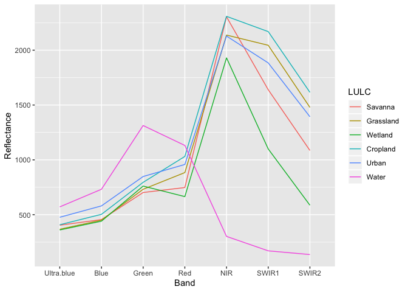

The spectral profiles show (dis)similarity in the reflectance of different features on the earth’s surface (or above it). ‘Water’ shows relatively low reflection in all wavelengths, while all other classes have relatively high reflectance in the longer wavelengts. Remember though that our training data only has 1000 points across 6 LULC classes only have a few observation for 3 of those classes.

------------------------------------------------------------------------

### **Classification**

So now let's try to predict LULC and produce our raster layer by fitting a classification model using the "randomForest" package.

``` r
library(randomForest)
RF_Model <- randomForest::randomForest(x = Training_Data_Reflectance[,2:8], y = Training_Data_Reflectance[,1])
RF_Model
```

    ## 
    ## Call:
    ##  randomForest(x = Training_Data_Reflectance[, 2:8], y = Training_Data_Reflectance[,      1]) 
    ##                Type of random forest: classification
    ##                      Number of trees: 500
    ## No. of variables tried at each split: 2
    ## 
    ##         OOB estimate of  error rate: 22.9%
    ## Confusion matrix:
    ##           Savanna Grassland Wetland Cropland Urban Water class.error
    ## Savanna         0         1       2        1     0     0  1.00000000
    ## Grassland       1       378       8       92     0     2  0.21413721
    ## Wetland         1        10      12        0     0     4  0.55555556
    ## Cropland        0        99       1      228     0     0  0.30487805
    ## Urban           0         2       0        2     0     0  1.00000000
    ## Water           0         1       2        0     0   153  0.01923077

By inspecting the output of the model, we realize it is not doing a super job. Again remember we only have a few observations in our training dataset. Classification of the 'water' class is pretty good, thanks to its particular spectral profile. Now that we have a model of the relationship between land cover and reflectance values, we can predict land cover over our entire region.

``` r
LULC_predicted <- raster::predict(object = Landsat_Band,
                                  model = RF_Model,
                                  progress = 'text',
                                  type = 'response',
                                  overwrite = TRUE) 
```

    ## 
      |                                                                       
      |                                                                 |   0%
      |                                                                       
      |================                                                 |  25%
      |                                                                       
      |================================                                 |  50%
      |                                                                       
      |=================================================                |  75%
      |                                                                       
      |=================================================================| 100%
    ## 

``` r
library(RColorBrewer)
factpal_LULC <- colorFactor(palette = brewer.pal(n = length(levels(Training_Data_DF$LULC)), name = "Set1"),
                            domain = c(1:length(levels(Training_Data_DF$LULC)))) # define color palette

leaflet() %>% # Plot
  addProviderTiles("Esri.WorldImagery") %>%
  addRasterImage(x = LULC_predicted,
                 color = factpal_LULC,
                 group = "Predicted LULC") %>%
  addLegend(title = "Predicted LULC",
            colors = brewer.pal(n = length(levels(Training_Data_DF$LULC)), name = "Set1"),
            labels = c("Savanna", "Grassland", "Wetland", "Cropland", "Urban", "Water"),
            opacity = 1) %>%
  addLayersControl(overlayGroups = c("Predicted LULC"))
```

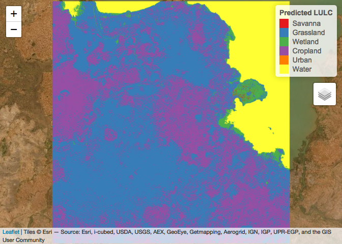

------------------------------------------------------------------------

### **Concluding remarks**

Now you have a sense of how remote sensing can be used to produce all sort of environmental layers. The quality of those will depend on the spatial and temporal resolutions of the sensors as well as the techniques used to process the raw data (clouds?) and model it to produce more useful layers.


------------------------------------------------------------------------

------------------------------------------------------------------------

3. Assignement
==============

Improve on the classification of the LULC above by including additional environmental variables (e.g, precipitation, temperature, distance to water bodies, elevation, ...) as predictors.
