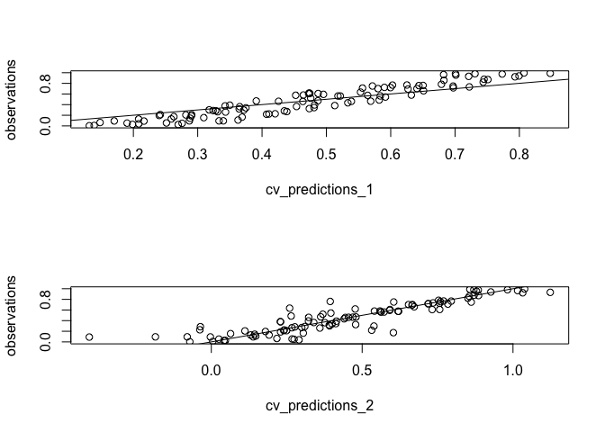
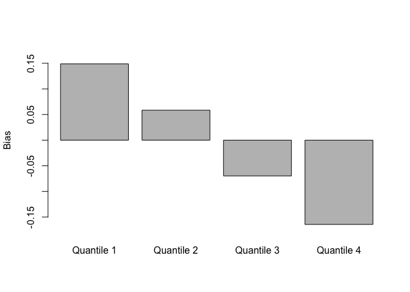
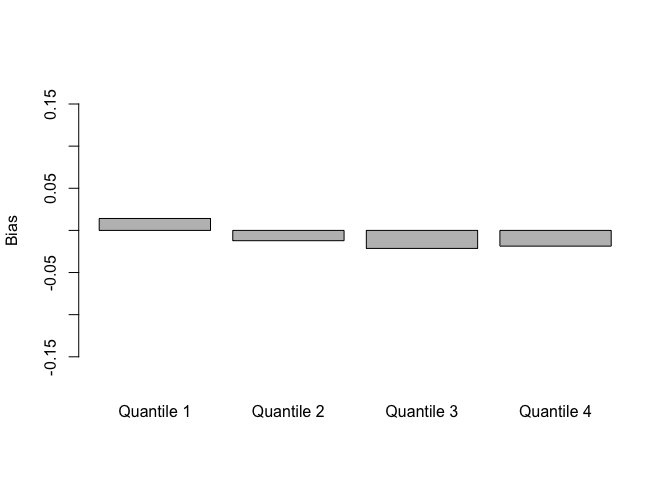

Evaluating prediction error in a model
================

Let’s imagine we have performed cross-validation on two prediction
methods we would like to compare. Let’s create some fake data to work
with.

``` r
set.seed(1981)
observations <- runif(100,0,1)
cv_predictions_1 <- observations * 0.6 + 0.2 + runif(100,-0.1,0.1)
cv_predictions_2 <- observations  + rnorm(100,0, abs(rnorm(100,0, 0.15)))
```

Let’s calculate MSE

``` r
library(Metrics)
mse(cv_predictions_1, observations)
```

    ## [1] 0.0181001

``` r
mse(cv_predictions_2, observations)
```

    ## [1] 0.01834065

In this instance, using MSE suggests that the first model (i.e. the one
that produces `cv_predictions_1`) is ‘better’. However, when we look at
the scatter plots, we can see there are some issues.

``` r
par(mfrow=c(2,1))
plot(cv_predictions_1, observations); abline(0,1)
plot(cv_predictions_2, observations); abline(0,1)
```

<!-- -->

The first issue is that model 2 has some outlier predictions. MSE will
penalize large deviations. So if there are a few predictions that are
way off, this is going to push MSE up a lot as you *square* the errors.
One way to explore this is to use Mean Absolute Error, which doesn’t
square errors.

``` r
mae(cv_predictions_1, observations)
```

    ## [1] 0.1158528

``` r
mae(cv_predictions_2, observations)
```

    ## [1] 0.08821243

MAE suggests that model 2 is best. Whether you choose MSE or MAE will
depend on how much you care about large deviations in predictions. The
other issue is that the model appears to be pulling everything towards
the mean. As a result, when observed values are low, predictions are too
high and when observations are high, predictions are too low. In
comparison, despite being noisier, predictions from model 2 don’t appear
to have these issues. To explore this quantitatively, you can look at
bias in the predictions. If we consider all the data at once, we can see
the predictions are not really bias in one direction overall.

``` r
bias(cv_predictions_1, observations)
```

    ## [1] 0.007127072

``` r
bias(cv_predictions_2, observations)
```

    ## [1] -0.008125728

But if we look at bias across quantiles, we see a different picture.

``` r
quantiles <- as.numeric(cut(observations, 4))
quant_bias <- data.frame(quant_bias_1 = NULL, quant_bias_2 = NULL)
for(i in 1:max(quantiles)){
  quant_bias_1 <- bias(cv_predictions_1[quantiles==i], observations[quantiles==i])
  quant_bias_2 <- bias(cv_predictions_2[quantiles==i], observations[quantiles==i])
  quant_bias <- rbind(quant_bias, cbind(quant_bias_1, quant_bias_2))
}
barplot(quant_bias$quant_bias_1,  names.arg = paste("Quantile", 1:max(quantiles)), ylab = "Bias", ylim=c(-0.18, 0.18))
```

<!-- -->

``` r
barplot(quant_bias$quant_bias_2,  names.arg = paste("Quantile", 1:max(quantiles)), ylab = "Bias",
ylim=c(-0.18, 0.18))
```

<!-- -->
