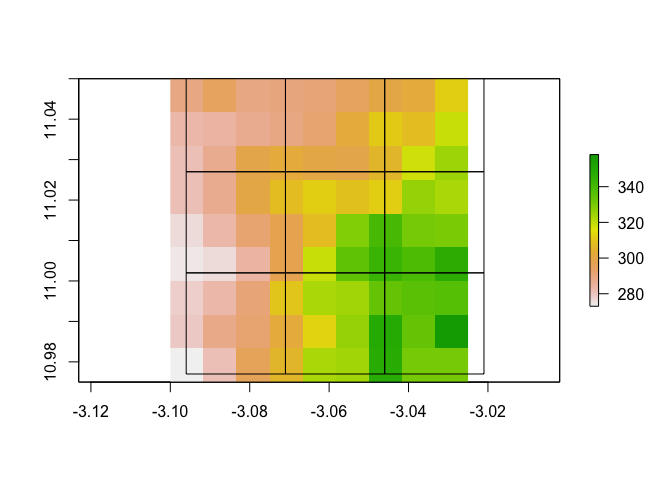
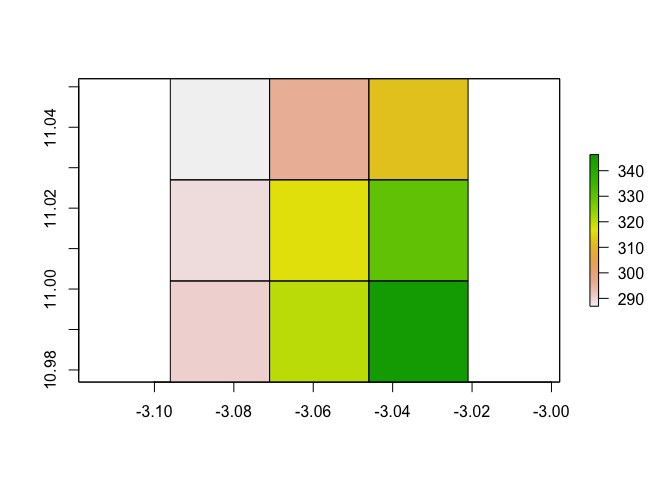
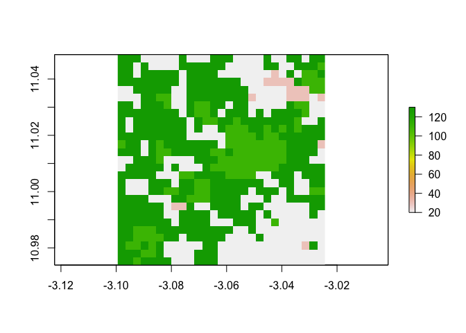
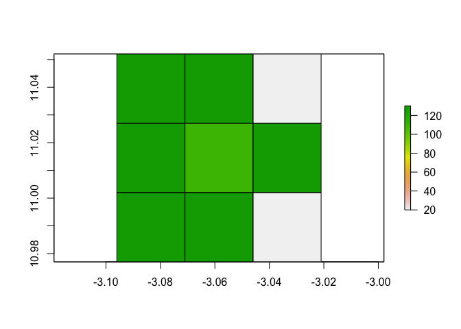
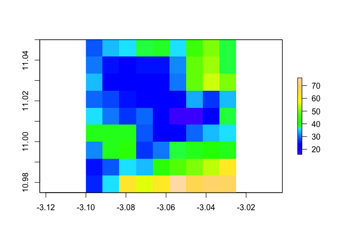
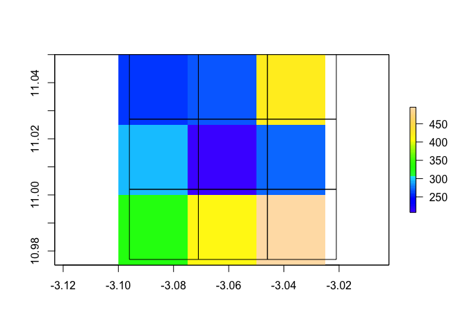
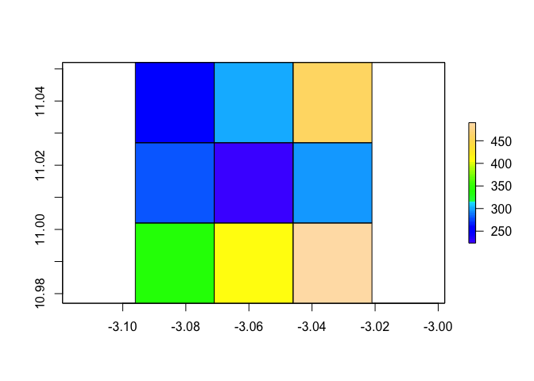

Raster resampling
================

This is a deep dive on raster resampling - an important aspect of
spatial analyses. There are a number of ways that rasters can be
resampled and the method you use is dependent on the data.

Let’s load up the data we need. For this example, we are going to load
up 3 different rasters of data from Burkina Faso. Elevation (continuous
outcome), land use (categorical) and population (count - from the
[WorldPop project](https://www.worldpop.org/))

``` r
library(raster)
```

    ## Loading required package: sp

``` r
BF_elev <- raster::getData("alt", country="BF")
BF_land_use <- raster("https://raw.githubusercontent.com/HughSt/HughSt.github.io/master/course_materials/week2/Lab_files/BF_land_use.tif")
pop <- raster("https://raw.githubusercontent.com/HughSt/HughSt.github.io/master/course_materials/week2/Assignment/BF_pop.tif")
```

In this case, `BF_land_use` isn’t in the same projection as `BF_elev`
and `pop`, so let’s reproject. Remember that as land use is categorical,
we have to specify `method = "ngb"` so that nearest neighbour
interpolation is used during reprojection, otherwise it will try to use
binlinear interpolation which will result in meaningless values.

``` r
crs(BF_land_use)
```

    ## CRS arguments:
    ##  +proj=merc +a=6378137 +b=6378137 +lat_ts=0.0 +lon_0=0.0 +x_0=0.0
    ## +y_0=0 +k=1.0 +units=m +nadgrids=@null +no_defs

``` r
crs(BF_elev)
```

    ## CRS arguments:
    ##  +proj=longlat +datum=WGS84 +ellps=WGS84 +towgs84=0,0,0

``` r
BF_land_use <- projectRaster(BF_land_use, crs=crs(BF_elev), method="ngb") # reproject - can time a little time
```

For demo purposes, we are going to crop the rasters across an arbitray
bounding boox.

``` r
BF_elev_crop <- crop(BF_elev, extent(BF_elev,499,507, 301,309))
pop_crop <- crop(pop, extent(BF_elev_crop))
BF_land_use_crop <- crop(BF_land_use, extent(BF_elev_crop))
```

Now let’s create a dummy lower resolution raster we are going to
resample to

``` r
new_raster <- aggregate(BF_elev_crop, fact=3)
new_raster <- raster::shift(new_raster, dx=0.004, dy=0.002)
new_raster_outline <- rasterToPolygons(new_raster, dissolve=TRUE)
```

    ## Loading required namespace: rgeos

Let’s plot the cropped elevation raster and overlay the grid of the new
raster we are resample to

``` r
plot(BF_elev_crop)

# plot cell outlines
lines(new_raster_outline)
```

<!-- -->

Now let’s resample elevation to the new raster. Here we can specify
`method = binlinear` because this type of interpolation makes sense for
a continuous outcome like elevation. In fact `method = binlinear` is the
default so we don’t really need to
specify.

``` r
BF_elev_crop_resampled_bilin <- resample(BF_elev_crop, new_raster, method="bilinear")
plot(BF_elev_crop_resampled_bilin)
lines(new_raster_outline)
```

<!-- -->

Now let’s repeat the resampling process with the land use raster. First
let’s plot and take a look at the frequency of different land use
categories.

``` r
plot(BF_land_use_crop)
```

<!-- -->

``` r
BF_land_use_crop
```

    ## class      : RasterLayer 
    ## dimensions : 27, 27, 729  (nrow, ncol, ncell)
    ## resolution : 0.00278, 0.00277  (x, y)
    ## extent     : -3.099435, -3.024375, 10.97389, 11.04868  (xmin, xmax, ymin, ymax)
    ## crs        : +proj=longlat +datum=WGS84 +ellps=WGS84 +towgs84=0,0,0 
    ## source     : memory
    ## names      : BF_land_use 
    ## values     : 20, 130  (min, max)

``` r
table(BF_land_use_crop[])
```

    ## 
    ##  20  30 110 130 
    ## 245  17 105 362

As this is categorial, and given that new raster is coarser (lower
resolution), first aggregate using the mode (i.e. most frequent) class.
He we aggregate by a factor of 9 because the resolution of
`the`new\_raster\` is 9 times coarser
thanBF\_land\_use\_crop

``` r
BF_land_use_crop_aggregated <- aggregate(BF_land_use_crop, fun='modal', fact = 9)
plot(BF_land_use_crop_aggregated)
lines(new_raster_outline)
```

<!-- -->

Now that the raster is at the right resolution, let’s resample to the
same
grid

``` r
BF_land_use_crop_aggregated_resamp <- resample(BF_land_use_crop_aggregated, new_raster, method = "ngb")
plot(BF_land_use_crop_aggregated_resamp)
lines(new_raster_outline)
```

<!-- -->

Now we have resampled a continuous and categorical raster, let’s repeat
on population. The raw data in the `pop_crop` shows the number of
individuals per cell. If we want to resample to a coarser resolution, we
are probably most interested in maintaining these as counts and
therefore we want to sum the numbers as opposed to use interpolation or
nearest neighbour.

Let’s have a look at the population raster

``` r
plot(pop_crop, col=topo.colors(64))
```

<!-- -->

``` r
cellStats(pop_crop, sum) 
```

    ## [1] 2955.148

As for the land use example, the new raster is at lower resolution.
Therefore have to aggregate first. As we want total population to remain
the same, aggregate by summing population

``` r
pop_crop_aggregated <- aggregate(pop_crop, fact = 3.012048, fun = sum)

# Check the total population is the same as the original raster
cellStats(pop_crop_aggregated, sum)
```

    ## [1] 2955.148

``` r
# Plot with new raster cell outlines
plot(pop_crop_aggregated, col=topo.colors(64))
lines(new_raster_outline)
```

<!-- -->

Now that the raster is at the right resolution, we can use the resample
function to estimate the counts in the new grid

``` r
pop_crop_aggregated_resamp <- resample(pop_crop_aggregated, new_raster)
plot(pop_crop_aggregated_resamp, col=topo.colors(64))
lines(new_raster_outline)
```

<!-- -->

The total should more or less be equal to the original - its not exact
as we have to use interpolation to predict populations in the new cell.

``` r
cellStats(pop_crop_aggregated_resamp, sum) # Not bad..
```

    ## [1] 3048.846
