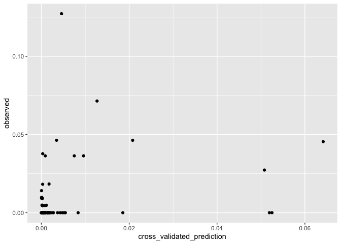

Performing v-folds cross-validation
================

Here we are going to go over how to perform v-folds cross validation of
a spatial model fit using the `spaMM` package.

``` r
library(raster)
```

    ## Loading required package: sp

``` r
library(spaMM)
```

    ## spaMM (version 3.0.0) is loaded.
    ## Type 'help(spaMM)' for a short introduction,
    ## and news(package='spaMM') for news.

``` r
library(caret)
```

    ## Loading required package: lattice

    ## Loading required package: ggplot2

``` r
library(ggplot2)
library(ModelMetrics)
```

    ## 
    ## Attaching package: 'ModelMetrics'

    ## The following objects are masked from 'package:caret':
    ## 
    ##     confusionMatrix, precision, recall, sensitivity, specificity

    ## The following object is masked from 'package:base':
    ## 
    ##     kappa

``` r
# Get Ethiopia malaria data
ETH_malaria_data <- read.csv("https://raw.githubusercontent.com/HughSt/HughSt.github.io/master/course_materials/week1/Lab_files/Data/mal_data_eth_2009_no_dups.csv", header=T)

# Get Biolclim layers
bioclim_layers <- raster::getData('worldclim', var='bio', res=0.5, lon=38.7578, lat=8.9806) # lng/lat for Addis Ababa
```

We can crop these layers to make them a little easier to
handle

``` r
ETH_Adm_1 <- raster::getData("GADM", country="ETH", level=1) # Admin boundaries
Oromia <- subset(ETH_Adm_1, NAME_1=="Oromia")
bioclim_layers_oromia <- crop(bioclim_layers, Oromia)
```

Now let’s extract Bio1 (Annual mean temperature) and Bio2 (Mean Diurnal
Range (Mean of monthly (max temp - min temp))) at the observation
points

``` r
ETH_malaria_data$bioclim1 <- extract(bioclim_layers_oromia[[1]], ETH_malaria_data[,c("longitude", "latitude")])
ETH_malaria_data$bioclim2 <- extract(bioclim_layers_oromia[[2]], ETH_malaria_data[,c("longitude", "latitude")])
```

### Splitting data into folds

In order to perform cross-validation, we need to split our data into
‘folds’ or sets of training/validation data. We are going to use the
caret package to create
folds.

``` r
folds_list <- caret::createFolds(ETH_malaria_data$pf_pr) # By defulat creates 10 folds
# folds_list <- createFolds(ETH_malaria_data, k = 20) # 20 fold
```

folds\_list is now a list of row indices for each validation dataset.
For example, the first fold is made of up the
    following

``` r
folds_list[[1]]
```

    ##  [1]   1  20  24  31  35  38  57  58  88  95 109 110 122 123 131 143 155
    ## [18] 175 184 203

Now we need to loop through each fold, fit a model to the training data,
predict to the validation data and store some validation statistics. You
could also write a function to do this and use lapply, but to make
things as clear as possible, lets use a
loop.

``` r
# before we loop through folds, lets create empty objects of things we want to keep 
cross_validated_prediction <- NULL
observed <- NULL

# Now loop through each fold, fitting the model to each training dataset of each fold, and predict to the validation data
for(fold in 1:length(folds_list)){
  
  training_data <- ETH_malaria_data[-folds_list[[fold]], ]
  validation_data <- ETH_malaria_data[folds_list[[fold]], ]
  
  # Fit model
  fold_mod_spatial <- spaMM::fitme(cbind(pf_pos, examined - pf_pos) ~ bioclim2 + Matern(1|latitude+longitude), data=training_data, family=binomial())
  
  # Predict
  x_valid_pred <- predict(fold_mod_spatial, validation_data)
  
  # Add to cross_validated_prediction
  cross_validated_prediction <- c(cross_validated_prediction,
                                  x_valid_pred)
  observed <- c(observed,
                validation_data$pf_pr)
}
```

We now have a vector of cross validated predictions and their
corresponding observed prevalence. We can use this to create a scatter
plot and/or estimate MSE.

``` r
ggplot() + geom_point(aes(cross_validated_prediction, observed))
```

<!-- -->

``` r
mse(cross_validated_prediction, observed)
```

    ## [1] 0.0001656956

If you want to compare models in terms of cross-validated prediction
error, you can repeat this process but swap the model/covariates.
