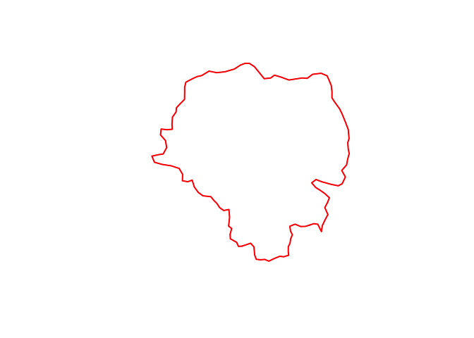
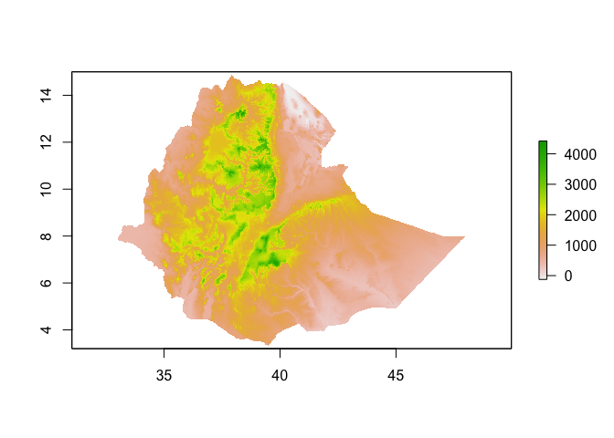
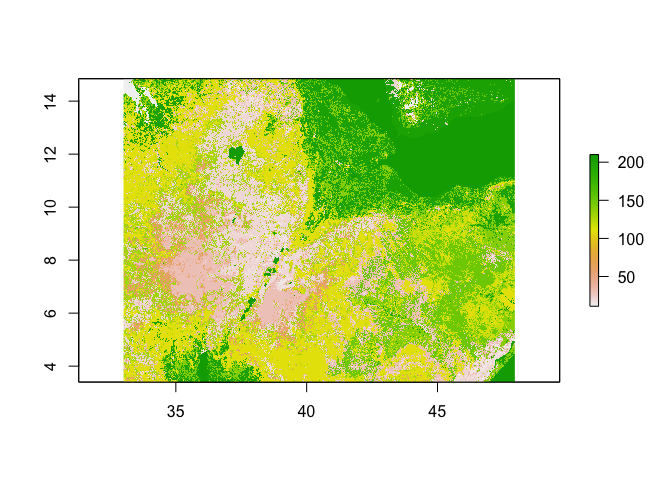
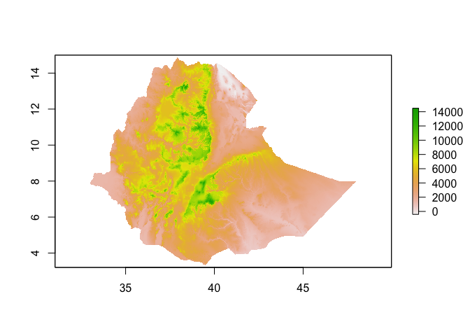

Week 2 - Manipulating spatial data
================

\#\# Week 2 - Manipulating spatial data

In week 1, you got to load up some spatial data and make some pretty
maps. This week, we will be stepping up a gear and learning how to crop
and subset spatial data. We will also be go through the process of
resampling rasters.

## Learning outcomes

By the end of this week, you will be able to:

  - Clip and subset vector and raster data
  - Resample rasters
  - Relate spatial data

Load the necessary libraries for this week

``` r
library(sp)
library(raster)
library(leaflet)
library(rgdal)
```

    ## rgdal: version: 1.4-4, (SVN revision 833)
    ##  Geospatial Data Abstraction Library extensions to R successfully loaded
    ##  Loaded GDAL runtime: GDAL 2.1.3, released 2017/20/01
    ##  Path to GDAL shared files: /Library/Frameworks/R.framework/Versions/3.5/Resources/library/rgdal/gdal
    ##  GDAL binary built with GEOS: FALSE 
    ##  Loaded PROJ.4 runtime: Rel. 4.9.3, 15 August 2016, [PJ_VERSION: 493]
    ##  Path to PROJ.4 shared files: /Library/Frameworks/R.framework/Versions/3.5/Resources/library/rgdal/proj
    ##  Linking to sp version: 1.3-1

``` r
library(geosphere)
library(rgeos)
```

    ## rgeos version: 0.4-3, (SVN revision 595)
    ##  GEOS runtime version: 3.6.1-CAPI-1.10.1 
    ##  Linking to sp version: 1.3-1 
    ##  Polygon checking: TRUE

``` r
library(wesanderson)
library(stats)
```

First we are going to subset some spatial (polygon) data. For this
excersize, we are going to use the admin 2 boundaries for Burkina Faso
we used in week 1. As a reminder, we can load these in from a local
shapefile using the readOGR function, or we can use the handy `getData`
function from the `raster` package to access GADM data.

``` r
ETH_Adm_1 <- raster::getData("GADM", country="ETH", level = 1)
```

You can subset a SpatialPolygonsDataFrame just like a data frame. Let’s
subset the data first by row/polygon

``` r
ETH_Adm_1_cropped <- ETH_Adm_1[1,]

# Get a summary of the cropped data
ETH_Adm_1_cropped
```

    ## class       : SpatialPolygonsDataFrame 
    ## features    : 1 
    ## extent      : 38.6394, 38.90624, 8.833486, 9.098195  (xmin, xmax, ymin, ymax)
    ## crs         : +proj=longlat +datum=WGS84 +no_defs +ellps=WGS84 +towgs84=0,0,0 
    ## variables   : 10
    ## names       : GID_0,   NAME_0,   GID_1,      NAME_1,                                     VARNAME_1, NL_NAME_1,    TYPE_1, ENGTYPE_1, CC_1, HASC_1 
    ## value       :   ETH, Ethiopia, ETH.1_1, Addis Abeba, Āddīs Ābaba|Addis Ababa|Adis-Abeba|Ādīs Ābeba,        NA, Astedader,      City,   14,  ET.AA

``` r
# Plot over the top of the full dataset
plot(ETH_Adm_1_cropped)
lines(ETH_Adm_1_cropped, col="red", lwd=2)
```

<!-- -->

You can also subset by name. For example, if we wanted to extract the
polygon representing the boundary of the province
“Cascades”

``` r
ETH_Adm_1_Amhara <- subset(ETH_Adm_1, ETH_Adm_1$NAME_1=="Amhara") #OR BF_Adm_1[BF_Adm_1$NAME_1=="Cascades",] will also work
ETH_Adm_1_Amhara
```

    ## class       : SpatialPolygonsDataFrame 
    ## features    : 1 
    ## extent      : 35.25711, 40.21244, 8.714812, 13.7687  (xmin, xmax, ymin, ymax)
    ## crs         : +proj=longlat +datum=WGS84 +no_defs +ellps=WGS84 +towgs84=0,0,0 
    ## variables   : 10
    ## names       : GID_0,   NAME_0,   GID_1, NAME_1, VARNAME_1, NL_NAME_1, TYPE_1, ENGTYPE_1, CC_1, HASC_1 
    ## value       :   ETH, Ethiopia, ETH.3_1, Amhara,     Amara,        NA,  Kilil,     State,   03,  ET.AM

``` r
#Plot the result
plot(ETH_Adm_1)
lines(ETH_Adm_1_Amhara, col="blue", lwd=2)
```

<!-- -->

## Spatial overlays

Often, we have point and polygon data and wish to relate them. For
example, we might want to summarize point data over regions. To
illustrate this, we are going to use the Burkina Faso malaria point
prevalence data and aggregate that to provincial level to get a
provincial level estimate of prevalence.

``` r
# Get the point prevalence data from the GitHub repo
ETH_malaria_data <- read.csv("https://raw.githubusercontent.com/HughSt/HughSt.github.io/master/course_materials/week1/Lab_files/Data/mal_data_eth_2009_no_dups.csv",header=T)

# Convert to a SPDF
ETH_malaria_data_SPDF <- SpatialPointsDataFrame(coords = ETH_malaria_data[,c("longitude", "latitude")],
                                      data = ETH_malaria_data[,c("examined", "pf_pos", "pf_pr")],
                                      proj4string = CRS("+init=epsg:4326"))
```

To identify the Province each point lies within you can use the `over`
function from the `sp` package

    ETH_Adm_1_per_point <- over(ETH_malaria_data_SPDF, ETH_Adm_1)
      Error in .local(x, y, returnList, fn, ...) : identicalCRS(x, y) is not TRUE

This throws an error, because `ETH_malaria_data_SPDF` and `ETH_Adm_1` do
not have exactly the same coordinate reference system (CRS). Let’s take
a look

``` r
crs(ETH_Adm_1)
```

    ## CRS arguments:
    ##  +proj=longlat +datum=WGS84 +no_defs +ellps=WGS84 +towgs84=0,0,0

``` r
crs(ETH_malaria_data_SPDF)
```

    ## CRS arguments:
    ##  +init=epsg:4326 +proj=longlat +datum=WGS84 +no_defs +ellps=WGS84
    ## +towgs84=0,0,0

To reproject to the same CRS, you can use the `spTransform` function
from the `sp`
package

``` r
ETH_malaria_data_SPDF <- spTransform(ETH_malaria_data_SPDF, crs(ETH_Adm_1))

# Check the new;y projected object
ETH_malaria_data_SPDF
```

    ## class       : SpatialPointsDataFrame 
    ## features    : 203 
    ## extent      : 34.5418, 42.4915, 3.8966, 9.9551  (xmin, xmax, ymin, ymax)
    ## crs         : +proj=longlat +datum=WGS84 +no_defs +ellps=WGS84 +towgs84=0,0,0 
    ## variables   : 3
    ## names       : examined, pf_pos,       pf_pr 
    ## min values  :       37,      0,           0 
    ## max values  :      221,     14, 0.127272727

Now we can re-run the over command

``` r
ETH_Adm_1_per_point <- over(ETH_malaria_data_SPDF, ETH_Adm_1)
```

This gives us a table where each row represents a point from
`ETH_malaria_data_SPDF` and columns represent the data from `ETH_Adm_1`.
Let’s take a
    look

``` r
head(ETH_Adm_1_per_point)
```

    ##   GID_0   NAME_0   GID_1 NAME_1 VARNAME_1 NL_NAME_1 TYPE_1 ENGTYPE_1 CC_1
    ## 1   ETH Ethiopia ETH.8_1 Oromia   Oromiya      <NA>  Kilil     State   04
    ## 2   ETH Ethiopia ETH.8_1 Oromia   Oromiya      <NA>  Kilil     State   04
    ## 3   ETH Ethiopia ETH.8_1 Oromia   Oromiya      <NA>  Kilil     State   04
    ## 4   ETH Ethiopia ETH.8_1 Oromia   Oromiya      <NA>  Kilil     State   04
    ## 5   ETH Ethiopia ETH.8_1 Oromia   Oromiya      <NA>  Kilil     State   04
    ## 6   ETH Ethiopia ETH.8_1 Oromia   Oromiya      <NA>  Kilil     State   04
    ##   HASC_1
    ## 1  ET.OR
    ## 2  ET.OR
    ## 3  ET.OR
    ## 4  ET.OR
    ## 5  ET.OR
    ## 6  ET.OR

Now we can use this to calculate admin unit specific statistics. We
might be interested in the number of sites per admin unit. To get that,
we could just create a frequency table

``` r
table(ETH_Adm_1_per_point$NAME_1)
```

    ## 
    ## Benshangul-Gumaz  Gambela Peoples           Oromia 
    ##                1                1              201

Or we can use the `tapply` function for more complex calculations.
`tapply` allows us to apply a function across groups. Let’s look at the
number examined per admin
unit

``` r
Nex_per_Adm1 <- tapply(ETH_malaria_data_SPDF$examined, ETH_Adm_1_per_point$NAME_1, sum)
Nex_per_Adm1
```

    ## Benshangul-Gumaz  Gambela Peoples           Oromia 
    ##              109              108            24350

Now let’s get the number of positives by admin
unit

``` r
Npos_per_Adm1 <- tapply(ETH_malaria_data_SPDF$pf_pos, ETH_Adm_1_per_point$NAME_1, sum)
Npos_per_Adm1
```

    ## Benshangul-Gumaz  Gambela Peoples           Oromia 
    ##                1                0               78

From these numbers, we can calculate the prevalence per province

``` r
prev_per_Adm1 <- Npos_per_Adm1 / Nex_per_Adm1
prev_per_Adm1
```

    ## Benshangul-Gumaz  Gambela Peoples           Oromia 
    ##      0.009174312      0.000000000      0.003203285

If you want to merge these provincial prevalence estimates back into the
province object `ETH_Adm_1` it is best practice to create a new table of
prevalence by provice with unique ID for each province. That unique ID
can be used to relate and merge the data with `ETH_Adm_1`.

First convert your prev\_per\_Adm1 vector into a dataframe with an ID
column

``` r
prev_per_Adm1_df <- data.frame(NAME_1 = names(prev_per_Adm1),
                               prevalence = prev_per_Adm1,
                               row.names=NULL)
```

Now merge this with the `ETH_Adm_1` data frame

``` r
ETH_Adm_1 <- merge(ETH_Adm_1, prev_per_Adm1_df,
                  by = "NAME_1")
```

You can now see that the additional `prevalence` field has been added

``` r
head(ETH_Adm_1)
```

    ##             NAME_1 GID_0   NAME_0   GID_1
    ## 1      Addis Abeba   ETH Ethiopia ETH.1_1
    ## 2             Afar   ETH Ethiopia ETH.2_1
    ## 3           Amhara   ETH Ethiopia ETH.3_1
    ## 4 Benshangul-Gumaz   ETH Ethiopia ETH.4_1
    ## 5        Dire Dawa   ETH Ethiopia ETH.5_1
    ## 6  Gambela Peoples   ETH Ethiopia ETH.6_1
    ##                                       VARNAME_1 NL_NAME_1    TYPE_1
    ## 1 Āddīs Ābaba|Addis Ababa|Adis-Abeba|Ādīs Ābeba      <NA> Astedader
    ## 2                                                    <NA>     Kilil
    ## 3                                         Amara      <NA>     Kilil
    ## 4                              Beneshangul Gumu      <NA>     Kilil
    ## 5                                                    <NA> Astedader
    ## 6                                       Gambela      <NA>     Kilil
    ##   ENGTYPE_1 CC_1 HASC_1  prevalence
    ## 1      City   14  ET.AA          NA
    ## 2     State   02  ET.AF          NA
    ## 3     State   03  ET.AM          NA
    ## 4     State   06  ET.BE 0.009174312
    ## 5      City   15  ET.DD          NA
    ## 6     State   12  ET.GA 0.000000000

We can now plot province colored by prevalence. Let’s use the leaflet
package

    # First define a color palette based on prevalence
    colorPal <- colorNumeric(wes_palette("Zissou1")[1:5], ETH_Adm_1$prevalence)
    
    # Plot with leaflet
    leaflet() %>% addProviderTiles("CartoDB.Positron") %>% addPolygons(data=ETH_Adm_1, 
                                             col=colorPal(ETH_Adm_1$prevalence),
                                             fillOpacity=0.6) %>%
                                             addLegend(pal = colorPal, 
                                             values = ETH_Adm_1$prevalence,
                                             title = "Prevalence")

# Manipulating raster data

You’ve now seen how to subset polygons and relate point and polygon
data. Now we are going to look at basic manipulations of raster data. We
are going to load 2 raster file, elevation and land use for Burkina
Faso.

``` r
# Get elevation using the getData function from the raster package
ETH_elev <- raster::getData("alt", country="ETH")
plot(ETH_elev)
```

<!-- -->

``` r
# Land use (# For information on land use classifications see http://due.esrin.esa.int/files/GLOBCOVER2009_Validation_Report_2.2.pdf)
ETH_land_use <- raster("https://github.com/HughSt/HughSt.github.io/blob/master/course_materials/week2/Lab_files/ETH_land_use.tif?raw=true")
ETH_land_use
```

    ## class      : RasterLayer 
    ## dimensions : 4121, 5384, 22187464  (nrow, ncol, ncell)
    ## resolution : 0.002777778, 0.002777778  (x, y)
    ## extent     : 33.00139, 47.95694, 3.398611, 14.84583  (xmin, xmax, ymin, ymax)
    ## crs        : +proj=longlat +datum=WGS84 +no_defs +ellps=WGS84 +towgs84=0,0,0 
    ## source     : https://github.com/HughSt/HughSt.github.io/blob/master/course_materials/week2/Lab_files/ETH_land_use.tif?raw=true 
    ## names      : ETH_land_use.tif.raw.true 
    ## values     : 11, 210  (min, max)

``` r
#Plot the land use raster
plot(ETH_land_use)
```

<!-- -->

``` r
# For a break down of the classes in BF aka how often each land use type occurs in BF
#(Note: this is just the number of pixels per land use type - NOT acres)
table(ETH_land_use[]) 
```

    ## 
    ##      11      14      20      30      40      60      90     110     120 
    ##  105074  336324 2451623 2223305  129786  813227       8 5254463  580793 
    ##     130     140     150     160     170     180     190     200     210 
    ## 1900890 1403832 1998099    6765      18   26026    6375 2947145 2003711

## Resampling rasters

Its good practice to resample rasters to the same extent and resolution
(i.e. same grid). This makes it easier to deal with later and to relate
rasters to each other. The `resample` command in the `raster` package
makes this process easy. The default method is bilinear interpolation,
which doesn’t make sense for our categorical variable, so we should use
the nearest neighbour function ‘ngb’

``` r
# Takes a little time to run..
ETH_land_use_resampled <- resample(ETH_land_use, ETH_elev, method="ngb") 

# Get summaries of both raster objects to check resolution and extent
# and to see whether resampled values look right
ETH_land_use_resampled
```

    ## class      : RasterLayer 
    ## dimensions : 1416, 1824, 2582784  (nrow, ncol, ncell)
    ## resolution : 0.008333333, 0.008333333  (x, y)
    ## extent     : 32.9, 48.1, 3.2, 15  (xmin, xmax, ymin, ymax)
    ## crs        : +proj=longlat +datum=WGS84 +ellps=WGS84 +towgs84=0,0,0 
    ## source     : memory
    ## names      : ETH_land_use.tif.raw.true 
    ## values     : 11, 210  (min, max)

``` r
ETH_elev
```

    ## class      : RasterLayer 
    ## dimensions : 1416, 1824, 2582784  (nrow, ncol, ncell)
    ## resolution : 0.008333333, 0.008333333  (x, y)
    ## extent     : 32.9, 48.1, 3.2, 15  (xmin, xmax, ymin, ymax)
    ## crs        : +proj=longlat +datum=WGS84 +ellps=WGS84 +towgs84=0,0,0 
    ## source     : /Users/sturrockh/Documents/Work/MEI/DiSARM/GitRepos/spatial-epi-course/_posts/ETH_msk_alt.grd 
    ## names      : ETH_msk_alt 
    ## values     : -189, 4420  (min, max)

## Manipulating rasters

It is often the case that we want to change the resolution of a raster
for analysis. For example, for computational reasons we might want to
work at a coarser resolution. First, let’s check the resolution

``` r
res(ETH_elev) # in decimal degrees. 1 dd roughly 111km at the equator
```

    ## [1] 0.008333333 0.008333333

Let’s aggregate (make lower resolution) by a factor of
10

``` r
ETH_elev_low_res <- aggregate(ETH_elev, fact = 10) # by default, calculates mean
res(ETH_elev_low_res)
```

    ## [1] 0.08333333 0.08333333

``` r
plot(ETH_elev_low_res)
```

<!-- -->

You can change the values of the pixels easily. For example, if you want
to change the `BF_elev` raster from its native meters to feet, you can
mulitply by 3.28

``` r
ETH_elev_feet <- ETH_elev*3.28
plot(ETH_elev_feet)
```

<!-- -->

Similarly, you can categorize raster values

``` r
ETH_elev_categorized <- cut(ETH_elev, 4)
plot(ETH_elev_categorized)
```

<!-- -->

If a raster is the same resolution and extent, you can perform joint
operations on them, for example subtract values of one from
another

``` r
new_raster <- ETH_elev - ETH_land_use_resampled # Meaningless! Just for illustrative purposes..
plot(new_raster)
```

<!-- -->

# Extracting data From rasters

Now let’s extract values of elevation at each survey point. You can use
the `extract` function from the raster package and insert the extracted
values as a new field on `ETH_malaria_data_SPDF`

``` r
ETH_malaria_data_SPDF$elev <- extract(ETH_elev, ETH_malaria_data_SPDF)
ETH_malaria_data_SPDF # now has 3 variables
```

    ## class       : SpatialPointsDataFrame 
    ## features    : 203 
    ## extent      : 34.5418, 42.4915, 3.8966, 9.9551  (xmin, xmax, ymin, ymax)
    ## crs         : +proj=longlat +datum=WGS84 +no_defs +ellps=WGS84 +towgs84=0,0,0 
    ## variables   : 4
    ## names       : examined, pf_pos,       pf_pr, elev 
    ## min values  :       37,      0,           0,  817 
    ## max values  :      221,     14, 0.127272727, 2451

You can also extract values using polygons e.g to get admin 1 level
elevations. You just have to define a function to apply, otherwise you
get all the pixel values per polygon. For very large rasters, check out
the `velox`
package.

``` r
ETH_Adm_1$elev <- extract(ETH_elev, ETH_Adm_1, fun=mean, na.rm=TRUE) # takes a little longer..
```

# Exploratory spatial analysis

We can now have a quick look at the relationship between prevalence and
elevation. First generate a prevalence
variable

``` r
ETH_malaria_data_SPDF$prevalence <- ETH_malaria_data_SPDF$pf_pos / ETH_malaria_data_SPDF$examined
```

Now you can plot the relationship between prevalence and elevation

``` r
plot(ETH_malaria_data_SPDF$elev, ETH_malaria_data_SPDF$prevalence)
```

<!-- -->

You might also be interested in distances to/from other features
(e.g. health facilities, water). Here we are going to load up a
waterbody layer (obtained via <http://www.diva-gis.org/Data>) and
calculate distance from each point. In this case, the file is in GeoJSON
format instead of Shapefile. `readOGR` is able to handle GeoJSON
easily.

``` r
waterbodies <- readOGR("https://raw.githubusercontent.com/HughSt/HughSt.github.io/master/course_materials/week2/Lab_files/ETH_waterbodies.geojson")
```

    ## OGR data source with driver: GeoJSON 
    ## Source: "https://raw.githubusercontent.com/HughSt/HughSt.github.io/master/course_materials/week2/Lab_files/ETH_waterbodies.geojson", layer: "OGRGeoJSON"
    ## with 380 features
    ## It has 5 fields

``` r
waterbodies
```

    ## class       : SpatialPolygonsDataFrame 
    ## features    : 380 
    ## extent      : 33.00001, 46.80059, 4.232061, 14.55  (xmin, xmax, ymin, ymax)
    ## crs         : +proj=longlat +datum=WGS84 +no_defs +ellps=WGS84 +towgs84=0,0,0 
    ## variables   : 5
    ## names       : ISO,  COUNTRY,                 F_CODE_DES,                             HYC_DESCRI,                  NAME 
    ## min values  : ETH, Ethiopia,               Inland Water, Non-Perennial/Intermittent/Fluctuating, ABAY WENZ (BLUE NILE) 
    ## max values  : ETH, Ethiopia, Land Subject to Inundation,                    Perennial/Permanent,           ZIWAY HAYK'

``` r
plot(waterbodies)
```

<!-- -->

The goesphere package has some nice functions such as `dist2Line` which
calculates distance in meters from spatial data recorded using decimal
degrees. Warning: takes a little while to compute

``` r
dist_to_water <- dist2Line(ETH_malaria_data_SPDF, waterbodies)
```

This produces a matrix, where each row represents each point in
`ETH_malaria_data_SPDF` and the first column is the distance in meters
to the nearest waterbody

``` r
head(dist_to_water)
```

    ##       distance      lon      lat  ID
    ## [1,] 116153.32 38.03253 6.426888 363
    ## [2,] 163802.37 38.56778 7.082849 358
    ## [3,] 137683.25 40.65231 8.808335 238
    ## [4,] 173427.48 37.62588 5.794201 367
    ## [5,]  40482.23 37.00735 4.811708 365
    ## [6,] 163677.02 38.56340 7.075962 358

``` r
# Can add to your data frame by extracting the first column
ETH_malaria_data_SPDF$dist_to_water <- dist_to_water[,1]
```

If the objects you are interested in calucating distance to are points
as opposed to polygons/lines (as above) you first have to calculate the
distance to every point and then identify the minimum. For example,
imagine waterbodies data was only available as a point dataset (we can
fake this by calculating the centroid of each polygon)

``` r
waterbodies_points <- gCentroid(waterbodies, byid=TRUE)
```

Now calucate a distance matrix showing distances between each
observation and each waterbody point. the `distm` function creates a
distance matrix between every pair of data points and waterbody points
in meters.

``` r
dist_matrix <- distm(ETH_malaria_data_SPDF, waterbodies_points)
```

Then use the apply function to apply the ‘minimum’ function to each row
(as each row represents the distance of every waterbody point from our
first observation)

``` r
ETH_malaria_data_SPDF$dist_to_water_point <- apply(dist_matrix, 1, min)
```
