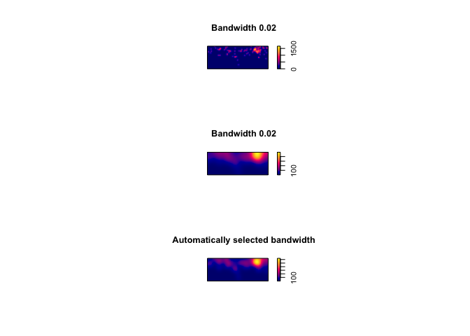
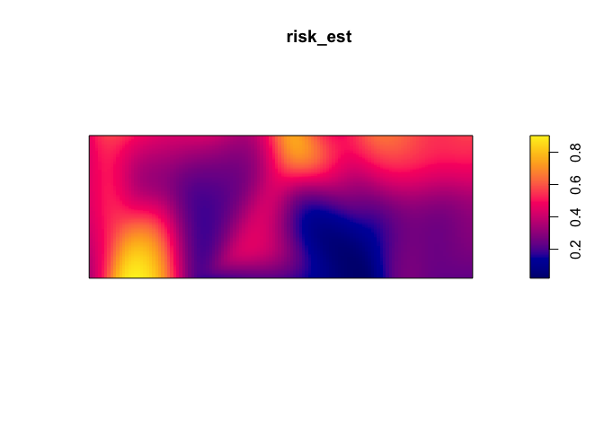
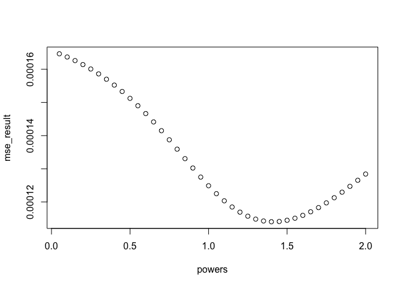
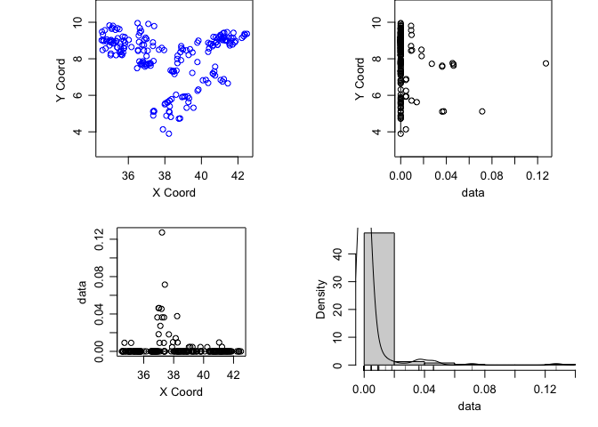

Untitled
================

This week we are going to explore methods to understand and predict risk
across space from point data.

``` r
library(Metrics)
library(spatstat)
```

    ## Loading required package: spatstat.data

    ## Loading required package: nlme

    ## Loading required package: rpart

    ## 
    ## spatstat 1.55-1       (nickname: 'Gamble Responsibly') 
    ## For an introduction to spatstat, type 'beginner'

    ## 
    ## Note: spatstat version 1.55-1 is out of date by more than a year; we strongly recommend upgrading to the latest version.

    ## 
    ## Attaching package: 'spatstat'

    ## The following object is masked from 'package:Metrics':
    ## 
    ##     auc

``` r
library(raster)
```

    ## Loading required package: sp

    ## 
    ## Attaching package: 'raster'

    ## The following objects are masked from 'package:spatstat':
    ## 
    ##     area, rotate, shift

    ## The following object is masked from 'package:nlme':
    ## 
    ##     getData

``` r
library(sp)
library(geoR)
```

    ## --------------------------------------------------------------
    ##  Analysis of Geostatistical Data
    ##  For an Introduction to geoR go to http://www.leg.ufpr.br/geoR
    ##  geoR version 1.7-5.2.1 (built on 2016-05-02) is now loaded
    ## --------------------------------------------------------------

``` r
library(gtools)
library(lme4)
```

    ## Loading required package: Matrix

    ## 
    ## Attaching package: 'lme4'

    ## The following object is masked from 'package:nlme':
    ## 
    ##     lmList

``` r
library(leaflet)
library(oro.nifti)
```

    ## oro.nifti 0.9.1

    ## 
    ## Attaching package: 'oro.nifti'

    ## The following objects are masked from 'package:raster':
    ## 
    ##     origin, origin<-, overlay

First load up some obfuscated malaria case-control data from Namibia.
This is comprised of latitudes and longitudes of cases and
controls.

``` r
CaseControl<-read.csv("https://raw.githubusercontent.com/HughSt/HughSt.github.io/master/course_materials/week3/Lab_files/CaseControl.csv")
head(CaseControl)
```

    ##   X.1 X household_id       lat     long case
    ## 1   1 1          1.1 -17.51470 16.05666    1
    ## 2   2 2          2.1 -17.82175 16.15147    1
    ## 3   3 3          3.1 -17.78743 15.93465    1
    ## 4   4 4          4.1 -17.51352 15.83933    1
    ## 5   5 5          5.1 -17.63668 15.91185    1
    ## 6   6 6          7.1 -17.64459 16.16105    1

To set ourselves up for further analyses, let’s create objects of just
cases and just controls

``` r
#Create a new object with just the cases, recoded as a number 1
Cases<-CaseControl[CaseControl$case==1,]

#Create a new object with just the controls, recoded as a number 0
Controls<-CaseControl[CaseControl$case==0,]
```

We are also going to create a `SpatialPointsDataFrame` of the
case-control
data

``` r
CaseControl_SPDF <- SpatialPointsDataFrame(coords = CaseControl[,c("long", "lat")],
                                           data = CaseControl[,c("household_id", "case")])
```

And get hold of a boundary file for Namibia

``` r
NAM_Adm0<-raster::getData('GADM',country='NAM',level=0)
```

Let’s plot and see what we have. First, create a color scheme based on
the case classification (0 or
1)

``` r
case_color_scheme <- colorNumeric(c("blue", "red"), CaseControl_SPDF$case)
```

Then,
    plot

    leaflet() %>% addTiles() %>% addCircleMarkers(data=CaseControl_SPDF, 
                                                  color = case_color_scheme(CaseControl_SPDF$case),
                                                  radius = 2)

## Risk Mapping using Kernel Density

To generate a kernel density estimate, we first need to generate point
pattern object of points (aka ppp). First, we need to define a window
defining the population from which the cases
arose

``` r
Nam_Owin <- owin(xrange=range(CaseControl$long),yrange=range(CaseControl$lat))
```

Now we can define the ppp object of the cases

``` r
Cases_ppp <- ppp(Cases$long, Cases$lat, window = Nam_Owin)
plot(Cases_ppp)
```

<!-- -->

We can now generate and plot a kernel density estimate of cases

``` r
case_density <- density(Cases_ppp)
plot(case_density) # Units are intensity of points per unit square
```

<!-- -->

Its possible to use different bandwidths. The larger the bandwidth, the
smoother the density
estimate.

``` r
plot(density(Cases_ppp,0.02))
```

<!-- -->

``` r
plot(density(Cases_ppp,0.1))
```

<!-- -->

``` r
plot(density(Cases_ppp,bw.ppl)) # automatic bandwidth selection based on cross-validation
```

<!-- -->

If you want to map using leaflet, you have to convert the density object
to a rasterLayer with a coordinate reference system

    # Create raster
    density_raster <- raster(density(Cases_ppp, bw.ppl), crs = crs(NAM_Adm0))
    
    # Plot
    leaflet() %>% addTiles() %>% addRasterImage(density_raster, opacity=0.6)

But this is just a density of cases, e.g. it doesn’t account for the
denominator - the controls. To do this, we can use the kelsall & diggle
method, which calculates the ratio of the density estimate of
cases:controls

First we have to add ‘marks’ to the points. Marks are just values
associated with each point such as case or control (1/0)

``` r
CaseControl_ppp <- ppp(CaseControl$long, CaseControl$lat, 
                       window = Nam_Owin, 
                       marks=as.factor(CaseControl$case))
```

If the ‘relative’ argument is not included in the code line, then it is
technically specified as ‘FALSE’, because that is the default. The
output is, therefore, the probability of being a case. Sigma is the
bandwidth.

``` r
risk_est <-  relrisk(CaseControl_ppp, sigma = 0.1) 
plot(risk_est)
```

<!-- -->

However, if you specify relative = TRUE in the code line, then the
output is the relative risk, the (probability of being a case, relative
to probability of being a control)

``` r
rel_risk_est <-  relrisk(CaseControl_ppp, relative = TRUE, sigma = 0.1)
plot(rel_risk_est)
```

<!-- -->

To plot on a web map, first specify the projection

``` r
risk_raster <- raster(risk_est, crs = crs(NAM_Adm0))
```

Then define a color
palette

``` r
pal <- colorNumeric(palette=tim.colors(64), domain=values(risk_raster), na.color = NA)
```

Then plot with
    leaflet

    leaflet() %>% addTiles("http://{s}.basemaps.cartocdn.com/light_all/{z}/{x}/{y}.png") %>% 
      addRasterImage(risk_raster, opacity=0.6, col = pal)

## Interpolation of point (prevalence etc.) data

First load BF malaria
data

``` r
ETH_malaria_data <- read.csv("https://raw.githubusercontent.com/HughSt/HughSt.github.io/master/course_materials/week1/Lab_files/Data/mal_data_eth_2009_no_dups.csv",header=T)
```

Get the Burkina Faso Adm 1 level raster

``` r
ETH_Adm_1 <- raster::getData("GADM", country="ETH", level=1)
```

## Inverse distance weighting (IDW)

Inverse distance weighting is one method of interpolation. To perform
IDW using the spatstat package, as per kernel density estimates, we have
to create a ppp object with the outcome we wish to interpolate as marks.
We have to start by setting the observation window. In this case, we are
going to use the bounding box around Oromia State from which these data
were collected. To set the window for the `ppp` function, we need to use
the `owin` function.

``` r
oromia <- ETH_Adm_1[ETH_Adm_1$NAME_1=="Oromia",]
oromia_window <- owin(oromia@bbox[1,], oromia@bbox[2,])

#Then define a ppp of the prevalence data
ETH_malaria_data_ppp<-ppp(ETH_malaria_data$longitude,ETH_malaria_data$latitude,
                         marks=ETH_malaria_data$pf_pr,window=oromia_window)
```

Set the parameters for displaying multiple plots in one screen

``` r
par(mfrow=c(2,2))

#Now plot different IDW results
# power represents the power function we want to use
# 'at' can be 'pixels' where it generates estimates across a grid of pixels
# or 'points' where it interpolates values at every point using 
# leave-one-out-cross validation
plot(idw(ETH_malaria_data_ppp, power=0.2, at="pixels"),col=heat.colors(20), main="power = 0.2") 
plot(idw(ETH_malaria_data_ppp, power=0.5, at="pixels"),col=heat.colors(20), main="power = 0.5")
plot(idw(ETH_malaria_data_ppp, power=1, at="pixels"),col=heat.colors(20), main="power = 0.1")
plot(idw(ETH_malaria_data_ppp, power=2, at="pixels"),col=heat.colors(20), main="power = 2") 
```

<!-- -->

# Plot using leaflet. Again,

``` r
# Convert to a raster
ETH_malaria_data_idw_raster <- raster(idw(ETH_malaria_data_ppp, power=0.2, at="pixels"),
                                     crs= crs(ETH_Adm_1))

#Define a color paletter
colPal <- colorNumeric(tim.colors(), ETH_malaria_data_idw_raster[], na.color = NA)
```

    #Plot
    leaflet() %>% addTiles() %>% addRasterImage(ETH_malaria_data_idw_raster, col = colPal, opacity=0.7) %>%
      addLegend(pal = colPal, values = ETH_malaria_data_idw_raster[])

To calculate the ‘best’ power to use, you can use cross-validation. This
is possible using the argument `at=points` when running the `idw`
function.

``` r
CV_idw_1 <- idw(ETH_malaria_data_ppp, power=3, at="points")
plot(ETH_malaria_data_ppp$marks, CV_idw_1, asp=1) 
```

<!-- -->

``` r
# Calculate Mean Squared Error (MSE)
mse(ETH_malaria_data_ppp$marks,CV_idw_1) # Mean squared error
```

    ## [1] 0.0001640973

## Kriging

We are going to use the GeoR package to perform kriging. First, we have
to create a geodata object with the package GeoR. This wants dataframe
of x,y and
data

``` r
ETH_malaria_data_geo <- as.geodata(ETH_malaria_data[,c("longitude","latitude","pf_pr")])
```

We can plot a summary plot using ther Lowes parameter. The Lowes option
gives us lowes curves for the relationship between x and y

``` r
plot(ETH_malaria_data_geo, lowes=T)
```

<!-- -->

It’s important to assess whether there is a first order trend in the
data before kriging. We can see from the plots of the prevalence against
the x and y coordinates that there isn’t really any evidence of such a
trend. Were there to be evidence, you can add `trend = 1st` or `trend
= 2nd` to the plot command to see the result after havin regressed
prevalence against x and y using a linear and polynomial effect
respectively.

Now generate and plot a variogram. As a rule of thumb, its a good idea
to limit variogram estimation to half the maximum interpoint distance

``` r
MaxDist <- max(dist(ETH_malaria_data[,c("longitude","latitude")]))  /2 
VarioCloud<-variog(ETH_malaria_data_geo, option="cloud", max.dist=MaxDist)
```

    ## variog: computing omnidirectional variogram

``` r
plot(VarioCloud) # all pairwise comparisons
```

<!-- -->

``` r
# To make it easier to interpret, we can bin points by distance
Vario <- variog(ETH_malaria_data_geo, max.dist = MaxDist)
```

    ## variog: computing omnidirectional variogram

``` r
plot(Vario)
```

<!-- -->

Its possible to change the way the variogram bins are constructed. Just
be careful not to have too few pairs of points in any distance
class.

``` r
Vario <- variog(ETH_malaria_data_geo,max.dist=MaxDist,uvec=seq(0.01,MaxDist,0.2)) 
```

    ## variog: computing omnidirectional variogram

``` r
#Let's look at the number in each bin
Vario$n
```

    ##  [1]  85 432 541 586 692 607 652 661 679 663 736 764 711 692 577 585 594
    ## [18] 551 630 724

``` r
#What is the minimum? A rule of thumb is 30 in each bin
min(Vario$n)
```

    ## [1] 85

``` r
#Plot
plot(Vario,pch=16)
```

<!-- -->

We can now fit variogram model by minimized least sqaures using
different covariance models. In this case we are just going to use a
‘spherical’ and ‘exponential’ model.

``` r
VarioMod_sph<-variofit(Vario, cov.model = "sph")
```

    ## variofit: covariance model used is spherical 
    ## variofit: weights used: npairs 
    ## variofit: minimisation function used: optim

    ## Warning in variofit(Vario, cov.model = "sph"): initial values not provided
    ## - running the default search

    ## variofit: searching for best initial value ... selected values:
    ##               sigmasq phi    tausq kappa
    ## initial.value "0"     "3.05" "0"   "0.5"
    ## status        "est"   "est"  "est" "fix"
    ## loss value: 2.28256710551259e-05

``` r
VarioMod_exp<-variofit(Vario, cov.model = "exp")
```

    ## variofit: covariance model used is exponential 
    ## variofit: weights used: npairs 
    ## variofit: minimisation function used: optim

    ## Warning in variofit(Vario, cov.model = "exp"): initial values not provided
    ## - running the default search

    ## variofit: searching for best initial value ... selected values:
    ##               sigmasq phi    tausq kappa
    ## initial.value "0"     "1.22" "0"   "0.5"
    ## status        "est"   "est"  "est" "fix"
    ## loss value: 2.76112575299845e-05

``` r
# plot results
plot(Vario,pch=16)
lines(VarioMod_sph,col="blue",lwd=2)
lines(VarioMod_exp,col="red",lwd=2) 
```

<!-- -->

``` r
# Get summaries of the fits
summary(VarioMod_sph)
```

    ## $pmethod
    ## [1] "WLS (weighted least squares)"
    ## 
    ## $cov.model
    ## [1] "spherical"
    ## 
    ## $spatial.component
    ##     sigmasq         phi 
    ## 0.000160867 3.048000000 
    ## 
    ## $spatial.component.extra
    ## kappa 
    ##   0.5 
    ## 
    ## $nugget.component
    ##        tausq 
    ## 8.043352e-05 
    ## 
    ## $fix.nugget
    ## [1] FALSE
    ## 
    ## $fix.kappa
    ## [1] TRUE
    ## 
    ## $practicalRange
    ## [1] 3.048
    ## 
    ## $sum.of.squares
    ##        value 
    ## 2.282567e-05 
    ## 
    ## $estimated.pars
    ##        tausq      sigmasq          phi 
    ## 8.043352e-05 1.608670e-04 3.048000e+00 
    ## 
    ## $weights
    ## [1] "npairs"
    ## 
    ## $call
    ## variofit(vario = Vario, cov.model = "sph")
    ## 
    ## attr(,"class")
    ## [1] "summary.variomodel"

``` r
summary(VarioMod_exp)
```

    ## $pmethod
    ## [1] "WLS (weighted least squares)"
    ## 
    ## $cov.model
    ## [1] "exponential"
    ## 
    ## $spatial.component
    ##      sigmasq          phi 
    ## 0.0002281533 1.2192006253 
    ## 
    ## $spatial.component.extra
    ## kappa 
    ##   0.5 
    ## 
    ## $nugget.component
    ##        tausq 
    ## 3.042044e-05 
    ## 
    ## $fix.nugget
    ## [1] FALSE
    ## 
    ## $fix.kappa
    ## [1] TRUE
    ## 
    ## $practicalRange
    ## [1] 3.652398
    ## 
    ## $sum.of.squares
    ##        value 
    ## 2.643998e-05 
    ## 
    ## $estimated.pars
    ##        tausq      sigmasq          phi 
    ## 3.042044e-05 2.281533e-04 1.219201e+00 
    ## 
    ## $weights
    ## [1] "npairs"
    ## 
    ## $call
    ## variofit(vario = Vario, cov.model = "exp")
    ## 
    ## attr(,"class")
    ## [1] "summary.variomodel"

In this case, the spherical model has a slightly lower sum of squares,
suggesting it provides a better fit to the data.

Now we have a variogram model depicting the covariance between pairs of
points as a function of distance between points, we can use it to Krig
values at prediction locations. To allow us to compare with IDW, first
get grid of points from the IDW example for comparison

``` r
# Create prediction grid
IDW <- idw(ETH_malaria_data_ppp, power=0.2, at="pixels")
pred_grid_x <- rep(IDW$xcol,length(IDW$yrow))
pred_grid_y <- sort(rep(IDW$yrow,length(IDW$xcol)))
pred_grid <- cbind(pred_grid_x,pred_grid_y)

# Now krig to those points
KrigPred <- krige.conv(ETH_malaria_data_geo, loc=pred_grid,
                       krige=krige.control(obj.model=VarioMod_sph))
```

    ## krige.conv: model with constant mean
    ## krige.conv: Kriging performed using global neighbourhood

``` r
# Visualize predictions
image(KrigPred,col=heat.colors(50))
```

<!-- -->

If you want to create a raster of your predictions, you can use the
`rasterFromXYZ` function

``` r
KrigPred_raster <- rasterFromXYZ(data.frame(x=pred_grid_x,
                                 y=pred_grid_y,
                                 z=KrigPred$predict))

plot(KrigPred_raster)
points(ETH_malaria_data[,c("longitude","latitude")],
       cex = ETH_malaria_data$pf_pr * 10)
```

<!-- -->

Generating cross-validated predictions in straightforward in geoR using
the `xvlalid` function

``` r
xvalid_result <- xvalid(ETH_malaria_data_geo, model = VarioMod_sph)
```

    ## xvalid: number of data locations       = 203
    ## xvalid: number of validation locations = 203
    ## xvalid: performing cross-validation at location ... 1, 2, 3, 4, 5, 6, 7, 8, 9, 10, 11, 12, 13, 14, 15, 16, 17, 18, 19, 20, 21, 22, 23, 24, 25, 26, 27, 28, 29, 30, 31, 32, 33, 34, 35, 36, 37, 38, 39, 40, 41, 42, 43, 44, 45, 46, 47, 48, 49, 50, 51, 52, 53, 54, 55, 56, 57, 58, 59, 60, 61, 62, 63, 64, 65, 66, 67, 68, 69, 70, 71, 72, 73, 74, 75, 76, 77, 78, 79, 80, 81, 82, 83, 84, 85, 86, 87, 88, 89, 90, 91, 92, 93, 94, 95, 96, 97, 98, 99, 100, 101, 102, 103, 104, 105, 106, 107, 108, 109, 110, 111, 112, 113, 114, 115, 116, 117, 118, 119, 120, 121, 122, 123, 124, 125, 126, 127, 128, 129, 130, 131, 132, 133, 134, 135, 136, 137, 138, 139, 140, 141, 142, 143, 144, 145, 146, 147, 148, 149, 150, 151, 152, 153, 154, 155, 156, 157, 158, 159, 160, 161, 162, 163, 164, 165, 166, 167, 168, 169, 170, 171, 172, 173, 174, 175, 176, 177, 178, 179, 180, 181, 182, 183, 184, 185, 186, 187, 188, 189, 190, 191, 192, 193, 194, 195, 196, 197, 198, 199, 200, 201, 202, 203, 
    ## xvalid: end of cross-validation

``` r
# By default it xvalidates point by point

#Plot on log odds scale
plot(xvalid_result$data,xvalid_result$predicted, asp=1)
abline(0,1)
```

<!-- -->
