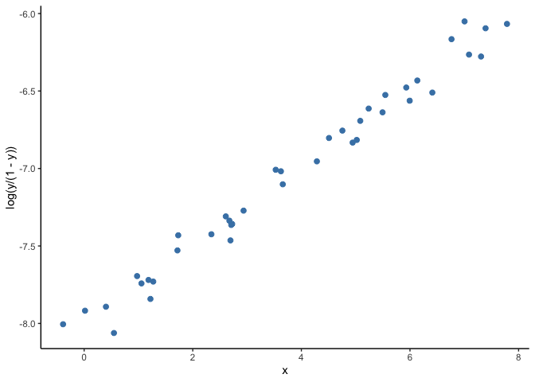

Introduction to spatial regression
================

## Week 6 - spatial regression

You now have the skills to: - map spatial data - obtain, generate and
manipulate raster data - conduct spatial interpolation - identify
clustering

This week, and in coming weeks, we are going to start putting these
concepts together as part of regression analyses. Regression analyses
allow us to look for associations between our outcome of interest
(e.g. prevalence of infection, incidence of disease etc.) and a set of
predictors.

### Univariate Linear Model

As a first step we will do a recap on a *linear regression model*. In
this problem we have a set of measurments of two variables, say \(X\)
and \(Y\), and we try to explain the values of our continuous outcome
\(Y\) based on the values on \(X\). To do this we find the line that is
the closest to all the points \((x, y)\).

Besides the code displayed here, we will use some additional code to
generate some toy datasets that will help illustrate the exposition.
Before starting we will load these code as well as the other required
libraries, including ggplot2 which will be used for creating most of the
images displayed.

``` r
library(ggplot2)
library(raster)
```

    ## Loading required package: sp

``` r
library(ModelMetrics)
```

    ## 
    ## Attaching package: 'ModelMetrics'

    ## The following object is masked from 'package:base':
    ## 
    ##     kappa

``` r
library(spaMM)
```

    ## spaMM (version 3.0.0) is loaded.
    ## Type 'help(spaMM)' for a short introduction,
    ## and news(package='spaMM') for news.

``` r
source("https://raw.githubusercontent.com/HughSt/HughSt.github.io/master/course_materials/week6/Lab_files/R%20Files/background_functions.R")
```

The command below generates a toy dataset that we will use as an
example.

``` r
# Generate example data
dset1 <- univariate_lm()

# Show data
head(dset1)
```

    ##             x         y
    ## 1 -0.38813740 -8.005137
    ## 2  0.01616137 -7.917746
    ## 3  0.40175907 -7.892104
    ## 4  0.54888497 -8.061714
    ## 5  0.97495187 -7.694279
    ## 6  1.05565842 -7.741698

In *R* we can fit a linear model and make predictions with the comands
shown next.

``` r
# Fit linear model on dataset 1
m1 <- lm(y ~ x, data = dset1)
m1_pred <- predict(m1, newdata = dset1, interval = "confidence")
dset1$y_hat <- m1_pred[,1]
dset1$y_lwr <- m1_pred[,2]
dset1$y_upr <- m1_pred[,3]
```

<!-- -->

### Univariate GLM

While very useful, it is common that the model above turns out to be a
not good assumption. Think of the case where \(Y\) is constrained to be
positive. A straight line, unless it is horizontal, will cross the
\(y\)-axis at some point. If the values of \(X\) where \(Y\) becomes
negative are rare or they are a set of values we are not interested in,
we may simply ignore them, however there are scenarios where we cannot
afford having impossible values for \(Y\).

As an example, we will load a second toy dataset where the outcome \(Y\)
is prevalence of infection (expressed as a probability) and fit a liner
regression model. Look at the bottom left corner of figure below. The
predictions of \(Y\) are starting to cross the zero value and become
negative, but the observed data remain positive.

``` r
# Fit linear model on dataset 2
dset2 <- univariate_glm()
m2 <- lm(y ~ x, data = dset2)
m2_pred <- predict(m2, newdata = dset1, interval = "confidence")
dset2$y_hat <- m2_pred[,1]
dset2$y_lwr <- m2_pred[,2]
dset2$y_upr <- m2_pred[,3]

ggplot(data=subset(dset2), aes(x, y)) + 
  geom_point(col="steelblue", size=2) + 
  geom_line(aes(x, y_hat), col="red") +
  geom_ribbon(aes(ymin=y_lwr, ymax=y_upr), fill="magenta", alpha=.25) +
  theme(panel.grid.major = element_blank(), panel.grid.minor = element_blank(), 
        panel.background = element_blank(), axis.line = element_line(colour = "black"))
```

<!-- -->

A solution to this problem is to use *generalized linear models* (GLM).
A GLM uses a transformation on \(Y\) where the assumptions of the
standard linear regression are valid (figure below), then it goes back
to the original scale of \(Y\) and makes predictions. For example, as
our outcome is a probability, we can use the common ‘logit’
transformation, also known as log odds, calculated as log(p/(1-p)) where
p is the probability of infection.
<!-- -->

When fitting a GLM to the dataset shown in the second example above, the
resulting predictions draw a curve that never reaches zero.
<!-- -->

Similarly, we can use the GLM framework to model other non-continuous
outcomes. These include binary outcomes (i.e. 0 and 1), multi-class
outcomes (e.g. ‘A’, ‘B’ and ‘C’) and counts (e.g. numbers of cases).
Here we are going to do a deep dive on binary and counts outcomes as
these are likely to be the most common types of outcomes you will deal
with.

For the binary case, we are going to use the Ethiopia malaria data.
While the outcome of interest here is prevalence, prevalence is just an
aggregate of the numbers of 1s and 0s at each location. In this instance
we can use what’s called a logistic regression as our data are binomial
(numbers positive out of a number examined). Logistic regression works
with the logit transformation.

As a reminder, this survey data contains information about number of
positive cases and number of examined people in different schools.
Spatial information is encoded in the fields *longitude* and *latitude*.

``` r
# Load data
ETH_malaria_data <- read.csv("https://raw.githubusercontent.com/HughSt/HughSt.github.io/master/course_materials/week1/Lab_files/Data/mal_data_eth_2009_no_dups.csv", header=T) # Case data
ETH_Adm_1 <- raster::getData("GADM", country="ETH", level=1) # Admin boundaries
Oromia <- subset(ETH_Adm_1, NAME_1=="Oromia")
# Plot both country and data points
raster::plot(Oromia)
points(ETH_malaria_data$longitude, ETH_malaria_data$latitude,
       pch = 16, ylab = "Latitude", xlab="Longitude", col="red", cex=.5)
```

<!-- -->

To model and predict malaria prevalence across Oromia State, we need to
first obtain predictors as rasters at a common resolution/extent. In
this example, we are going to use two of the
[Bioclim](https://www.worldclim.org/bioclim) layers, accessible using
the `getData` function in the raster
package.

``` r
bioclim_layers <- raster::getData('worldclim', var='bio', res=0.5, lon=38.7578, lat=8.9806) # lng/lat for Addis Ababa
```

We can crop these layers to make them a little easier to handle

``` r
bioclim_layers_oromia <- crop(bioclim_layers, Oromia)
plot(bioclim_layers_oromia[[1]]) # Bio1 - Annual mean temperature
lines(Oromia)
```

<!-- -->

Now let’s extract Bio1 (Annual mean temperature) and Bio2 (Mean Diurnal
Range (Mean of monthly (max temp - min temp))) at the observation
points

``` r
ETH_malaria_data$bioclim1 <- extract(bioclim_layers_oromia[[1]], ETH_malaria_data[,c("longitude", "latitude")])
ETH_malaria_data$bioclim2 <- extract(bioclim_layers_oromia[[2]], ETH_malaria_data[,c("longitude", "latitude")])
```

Now we fit the model. In the binomial case, it is possible to have a 2
columned matrix as the outcome representing numbers positive and numbers
negative. Our outcome could also be a set of 0s and 1s if we had
individual level
data.

``` r
glm_mod_1 <- glm(cbind(pf_pos, examined - pf_pos) ~ bioclim1 + bioclim2, data=ETH_malaria_data, family=binomial())
```

Now let’s take a look at the model output:

``` r
summary(glm_mod_1)
```

    ## 
    ## Call:
    ## glm(formula = cbind(pf_pos, examined - pf_pos) ~ bioclim1 + bioclim2, 
    ##     family = binomial(), data = ETH_malaria_data)
    ## 
    ## Deviance Residuals: 
    ##     Min       1Q   Median       3Q      Max  
    ## -1.4327  -0.9205  -0.7473  -0.5879   7.6321  
    ## 
    ## Coefficients:
    ##               Estimate Std. Error z value Pr(>|z|)    
    ## (Intercept) -13.717021   2.189372  -6.265 3.72e-10 ***
    ## bioclim1      0.008466   0.006164   1.374 0.169577    
    ## bioclim2      0.044857   0.012550   3.574 0.000351 ***
    ## ---
    ## Signif. codes:  0 '***' 0.001 '**' 0.01 '*' 0.05 '.' 0.1 ' ' 1
    ## 
    ## (Dispersion parameter for binomial family taken to be 1)
    ## 
    ##     Null deviance: 383.42  on 202  degrees of freedom
    ## Residual deviance: 368.12  on 200  degrees of freedom
    ## AIC: 444.27
    ## 
    ## Number of Fisher Scoring iterations: 6

The `Deviance Residuals:` shows us the variation in how far away our
observations are from the predicted values. Observations with a deviance
residual in excess of two may indicate lack of fit.

The `Coefficients` show us the slope of the line fit for each predictor
which tells us something about the direction of the association.
Positive coefficients suggest a positive relationship and negative a
negative relationship. These are all expressed on the log scale as we
are working in logit space. The standard error and z values are used to
calculate the p-value which tells us how likely this relationship was
observed by chance. If you want to express your coefficients as odds
ratios, you can exponentiate these values. E.g. the estimate for bioclim
1 is is 0.008466 which is an odds ratio of 1.009.

The `Null deviance` tells us how well a model only with the intercept
(i.e. if you assume the mean at every location) fits the data. `Residual
deviance` tells us how well the model with the predictors fits the data.
Lower values (i.e. less deviation of the predicted value from the
observed) is better.

In this case, it looks like there is only evidence that bioclim1 is
related to prevalence but bioclim2 is. Let’s try re-running the model
without bioclim
1.

``` r
glm_mod_2 <- glm(cbind(pf_pos, examined - pf_pos) ~ bioclim2, data=ETH_malaria_data, family=binomial())
summary(glm_mod_2)
```

    ## 
    ## Call:
    ## glm(formula = cbind(pf_pos, examined - pf_pos) ~ bioclim2, family = binomial(), 
    ##     data = ETH_malaria_data)
    ## 
    ## Deviance Residuals: 
    ##     Min       1Q   Median       3Q      Max  
    ## -1.3321  -0.9212  -0.7507  -0.6068   7.5499  
    ## 
    ## Coefficients:
    ##              Estimate Std. Error z value Pr(>|z|)    
    ## (Intercept) -11.97128    1.78167  -6.719 1.83e-11 ***
    ## bioclim2      0.04455    0.01254   3.554 0.000379 ***
    ## ---
    ## Signif. codes:  0 '***' 0.001 '**' 0.01 '*' 0.05 '.' 0.1 ' ' 1
    ## 
    ## (Dispersion parameter for binomial family taken to be 1)
    ## 
    ##     Null deviance: 383.42  on 202  degrees of freedom
    ## Residual deviance: 369.98  on 201  degrees of freedom
    ## AIC: 444.12
    ## 
    ## Number of Fisher Scoring iterations: 6

OK the estimate for bioclim2 is 0.04455 which is an odds ratio of 1.05.
This means that for every unit increase in mean diurnal range, the odds
of infection increase by 5%.

It is possible to explore associations with other sensible covariates in
the same way, i.e. by including them in the model and seeing which are
‘significant’. This kind of forward stepwise method to select
variables is only 1 way to build a model. Some advocate using AIC or
cross-validation techniques which we will introduce later.

It is also useful to check your fitted values (i.e. predictions at your
data points) line up with the
observations.

``` r
ggplot() + geom_point(aes(glm_mod_2$fitted, ETH_malaria_data$pf_pr))
```

<!-- -->

Our fitted values don’t line up particularly well with the observed
data, suggesting that bioclim2 alone doesn’t explain prevalence very
well.

Once you have a final model you are happy with, it is now possible to
predict prevalence at all other locations using the model covariates. In
this case, we have a model with only bioclim2. Let’s assume this is our
final model and make predictions using this variable.

As we only have 1 covariate, there is no need to worry about resampling
rasters. If you are using multiple covariates, you should ensure these
are resampled to the same grid (extent and resolution) before extracting
and modeling. As a reminder,
[here](https://github.com/HughSt/HughSt.github.io/blob/master/_posts/raster_resampling.md)
is a walkthrough of resmapling.

If you want to predict using a model, you have to provide a data.frame
of observations (points) with the same variables used in the model. If
you want to produce a risk map, i.e. predict prevalence over a grid,
instead of providing a data.frame, the `raster` package allows you to
predict using a model and a raster (layer or stack if multiple layers).
Let’s try both.

``` r
# Make a prediction at a single location
# with a bioclim2 value of 120
prediction_point <- data.frame(bioclim2 = 120)

# Now predict. Using type='response' tells R you want 
# predictions on the probability scale instead of 
# log odds
predict(glm_mod_2, prediction_point,  type="response")
```

    ##          1 
    ## 0.00132496

``` r
# Now let's predict over the whole raster. We first have to 
# make sure that the raster layer(s) pf the covariates
# we want to use to predict have the same name
# as that used in the model (i.e. 'bioclim2')
pred_raster <- bioclim_layers_oromia[[2]]
names(pred_raster) <- 'bioclim2'

# Now as we are predicting using a raster, we specify the
# raster first, then the model
predicted_risk <- predict(pred_raster,
                          glm_mod_2,
                          type='response')

# Now plot
plot(predicted_risk)
```

<!-- -->

``` r
# or masked to Oromia
predicted_risk_masked <- mask(predicted_risk, Oromia)
plot(predicted_risk_masked)
```

<!-- -->

One of the assumptions we make when fitting GLMs is that the residuals
of the model (i.e. what isn’t explained by the covairates) are
independent. Often, however, with spatial data this assumption isn’t
met. Neighboring values are often correlated with each other. This
raises 2
questions:

#### 1\) How do you know whether there is any residual spatial autocorrelation?

If there is no residual spatial autocorrelation, then we can trust the
regression estimates. To test whether the residuals are independent, we
can use Moran’s coefficient (as introduced in
[Week 4](https://hughst.github.io/week-4/). The table and plot displayed
below is a spatial autocorrelogram suggests that there is spatial
autocorrelation up to scales of ~1.2 decimal degress and therefore that
the residuals are not independent.

``` r
# Compute correlogram of the residuals
nbc <- 10
cor_r <- pgirmess::correlog(coords=ETH_malaria_data[,c("longitude", "latitude")],
                            z=glm_mod_2$residuals,
                            method="Moran", nbclass=nbc)

cor_r
```

    ## Moran I statistic 
    ##       dist.class         coef      p.value    n
    ##  [1,]  0.3979675  0.139537758 1.452043e-14 3904
    ##  [2,]  1.1937029  0.027455904 1.132424e-02 5192
    ##  [3,]  1.9894379 -0.015590957 7.771255e-01 5680
    ##  [4,]  2.7851728  0.021688238 4.436913e-02 4976
    ##  [5,]  3.5809077 -0.029494019 9.462506e-01 5078
    ##  [6,]  4.3766427 -0.037610752 9.943232e-01 5896
    ##  [7,]  5.1723776 -0.021069731 8.480308e-01 4890
    ##  [8,]  5.9681126 -0.009427237 5.663123e-01 3694
    ##  [9,]  6.7638475 -0.006745678 4.501948e-01 1412
    ## [10,]  7.5595825 -0.019553283 4.527890e-01  284

``` r
correlograms <- as.data.frame(cor_r)
correlograms$variable <- "residuals_glm" 

# Plot correlogram
ggplot(subset(correlograms, variable=="residuals_glm"), aes(dist.class, coef)) + 
  geom_hline(yintercept = 0, col="grey") +
  geom_line(col="steelblue") + 
  geom_point(col="steelblue") +
  xlab("distance") + 
  ylab("Moran's coefficient")+
  theme(panel.grid.major = element_blank(), panel.grid.minor = element_blank(), 
        panel.background = element_blank(), axis.line = element_line(colour = "black"))
```

<!-- -->

OK, so we’ve established that our model violates the assumptions of a
GLM. This leads to the next
question

#### 2\) If residual spatial autocorrelation is present, what can we do about it?

As introduced in [Week 3](https://hughst.github.io/week-3/), the core
idea behind Spatial Statistics is to understand an characterize this
spatial dependence that is observed in different processes, for example:
amount of rainfall, global temperature, air pollution, etc. Spatial
Statistics deal with problems were nearby things are expected to be more
alike.

When want to measure how much two variables change together, we use the
covariance function. Covariance functions are effectively the same as
the variogram models you explored in
[Week 3](https://hughst.github.io/week-3/) and are used to estimate the
similarity between values in space as a function of the distnace between
them. Under the right assumptions, we can also use the covariance
function to describe the similarity of the observed values based on
their location.

A covariance function *K* : 𝕊 × 𝕊 → ℝ maps a pair of points
*z*<sub>1</sub> = (*s*<sub>\[1, 1\]</sub>, *s*<sub>\[1, 2\]</sub>) and
*z*<sub>2</sub> = (*s*<sub>\[2, 1\]</sub>, *s*<sub>\[2, 2\]</sub>) to
the real line. We can define such a function in terms of the distance
between a pair of points. Let the distance between the points be given
by *r* = ∥*z*<sub>1</sub> − *z*<sub>2</sub>∥, the following are examples
of covarinace functions:

Exponentiated Quadratic:
*K*(*z*<sub>1</sub>, *z*<sub>2</sub>)=*σ*<sup>2</sup>exp(−*r*<sup>2</sup>/*ρ*<sup>2</sup>)

Rational Quadratic:
*K*(*z*<sub>1</sub>, *z*<sub>2</sub>)=*σ*<sup>2</sup>(1 + *r*<sup>2</sup>/(2*αρ*<sup>2</sup>))<sup>−*α*</sup>

Matern Covariance:
*K*(*z*<sub>1</sub>, *z*<sub>2</sub>)=*σ*<sup>2</sup>2<sup>1 − *ν*</sup>/*Γ*(*ν*)((2*ν*)<sup>.5</sup>*r*/*ρ*)<sup>*ν*</sup>𝒦<sub>*ν*</sub>((2*ν*)<sup>.5</sup>*r*/*ρ*)

Here, nu (*ν*) represents the ‘smoothness’ parameter, alpha *α*
determines the relative weighting of large-scale and small-scale
variations, rho (*ρ*) the scale parameter, *Γ* is the gamma function and
𝒦<sub>*ν*</sub> is the modified Bessel function of second kind. In the
three cases, while less clear in the Matern case, the covariance
decreases asymptotically towards zero the larger the value of *r*. This
is the more distance between a pair of points, the weaker the covariance
between them.

The election of which covariance function to use depends on our
assumptions about the change in the association between the points
across space (eg., the speed of decay).

## Geostatistics

Now that we have discussed how the covariance function can help model
spatial dependence, we can discuss how to incorporate this ideas into
our model. In our GLM example above we fitted a model of the
form

*η*<sub>*i*</sub> = *β*<sub>0</sub> + *β*<sub>1</sub>*x*<sub>*i*</sub> + *e*<sub>*i*</sub>,

Now we will incorporate an spatially correlated random effect
(*b*<sub>*i*</sub>):

*η*<sub>*i*</sub> = *β*<sub>0</sub> + *β*<sub>1</sub>*x*<sub>*i*</sub> + *e*<sub>*i*</sub> + *b*<sub>*i*</sub>
where spatial correlation is modeled using a covariance function *K*.

We can implement this model, assuming a Matern covariance, as shown
below.

``` r
glm_mod_2_spatial <- spaMM::fitme(cbind(pf_pos, examined - pf_pos) ~ bioclim2 + Matern(1|latitude+longitude), data=ETH_malaria_data, family=binomial())
summary(glm_mod_2_spatial)
```

    ## formula: cbind(pf_pos, examined - pf_pos) ~ bioclim2 + Matern(1 | latitude + 
    ##     longitude)
    ## Estimation of corrPars and lambda by Laplace ML approximation (p_v).
    ## Estimation of fixed effects by Laplace ML approximation (p_v).
    ## Estimation of lambda by 'outer' ML, maximizing p_v.
    ## Family: binomial ( link = logit ) 
    ##  ------------ Fixed effects (beta) ------------
    ##             Estimate Cond. SE t-value
    ## (Intercept) -9.84455  5.61006 -1.7548
    ## bioclim2     0.01136  0.04051  0.2803
    ##  --------------- Random effects ---------------
    ## Family: gaussian ( link = identity ) 
    ##                    --- Correlation parameters:
    ##      1.nu     1.rho 
    ## 0.4695574 2.4472962 
    ##            --- Variance parameters ('lambda'):
    ## lambda = var(u) for u ~ Gaussian; 
    ##    latitude .  :  4.845  
    ## # of obs: 203; # of groups: latitude ., 203 
    ##  ------------- Likelihood values  -------------
    ##                         logLik
    ## p_v(h) (marginal L): -107.5769

`nu` (*ν*) represents the ‘smoothness’ parameter and `rho` (*ρ*) the
scale parameter. `lambda` is the estimated variance in the random effect
and `phi` the estimated variance in the residual error.

You can see that the estimate for the effect of bioclim2 has dropped
towards 0. While `spaMM` doesn’t provide p-values, you can calculate the
95% confidence intervals as
    follows.

``` r
coefs <- as.data.frame(summary(glm_mod_2_spatial)$beta_table)
```

    ## formula: cbind(pf_pos, examined - pf_pos) ~ bioclim2 + Matern(1 | latitude + 
    ##     longitude)
    ## Estimation of corrPars and lambda by Laplace ML approximation (p_v).
    ## Estimation of fixed effects by Laplace ML approximation (p_v).
    ## Estimation of lambda by 'outer' ML, maximizing p_v.
    ## Family: binomial ( link = logit ) 
    ##  ------------ Fixed effects (beta) ------------
    ##             Estimate Cond. SE t-value
    ## (Intercept) -9.84455  5.61006 -1.7548
    ## bioclim2     0.01136  0.04051  0.2803
    ##  --------------- Random effects ---------------
    ## Family: gaussian ( link = identity ) 
    ##                    --- Correlation parameters:
    ##      1.nu     1.rho 
    ## 0.4695574 2.4472962 
    ##            --- Variance parameters ('lambda'):
    ## lambda = var(u) for u ~ Gaussian; 
    ##    latitude .  :  4.845  
    ## # of obs: 203; # of groups: latitude ., 203 
    ##  ------------- Likelihood values  -------------
    ##                         logLik
    ## p_v(h) (marginal L): -107.5769

``` r
row <- row.names(coefs) %in% c('bioclim2')
lower <- coefs[row,'Estimate'] - 1.96*coefs[row, 'Cond. SE']
upper <- coefs[row,'Estimate'] + 1.96*coefs[row, 'Cond. SE']
c(lower, upper)
```

    ## [1] -0.06803875  0.09074934

``` r
# If you want to express as an odds ratio
OR <- exp(c(lower, upper))
```

Which shows that having accounted for spatial autocorrelation, there is
no evidence that ‘Bioclim2’ is associated with malaria prevalence.

We can also re-test for residual spatial autocorrelation to make sure
that this is removed by our spatial model as specified.

``` r
# Compute correlogram of the residuals
nbc <- 10
cor_r <- pgirmess::correlog(coords = ETH_malaria_data[,c("longitude", "latitude")],
                            z = residuals(glm_mod_2_spatial),
                            method="Moran", nbclass=nbc)
cor_r
```

    ## Moran I statistic 
    ##       dist.class         coef   p.value    n
    ##  [1,]  0.3979675 -0.082103557 0.9982340 3904
    ##  [2,]  1.1937029 -0.004771094 0.4963582 5192
    ##  [3,]  1.9894379 -0.010640882 0.6170209 5680
    ##  [4,]  2.7851728  0.005227741 0.3144509 4976
    ##  [5,]  3.5809077 -0.007276726 0.5446715 5078
    ##  [6,]  4.3766427  0.007878155 0.2362530 5896
    ##  [7,]  5.1723776 -0.010644341 0.5983817 4890
    ##  [8,]  5.9681126  0.010933890 0.2718782 3694
    ##  [9,]  6.7638475 -0.009638177 0.4949906 1412
    ## [10,]  7.5595825 -0.007011994 0.3814165  284

### Prediction

Once you have a model that relates our climatic (or other spatial)
layers to prevalence, we can predict the probability/prevalence of
infection at any location within the region our data are representative
where we have values of these climatic layers. For the purpose of
demonstration, we are going to assume that bioclim2 is related to
prevalence and will therefore be used to make predictions. It is
possible to predict from a model directly onto a raster stack of
covariates which makes life easy. However, in this case, we are using a
geostatistical model, which includes latitude and longitude, and
therefore we need to generate rasters of these to add to the stack of
bioclim2.

``` r
# Create an empty raster with the same extent and resolution as the bioclimatic layers
latitude_raster <- longitude_raster <-raster(nrows = nrow(bioclim_layers_oromia),
                                       ncols = ncol(bioclim_layers_oromia),
                                                    ext = extent(bioclim_layers_oromia))

# Change the values to be latitude and longitude respectively
longitude_raster[] <- coordinates(longitude_raster)[,1]
latitude_raster[] <- coordinates(latitude_raster)[,2]

# Now create a final prediction stack of the 4 variables we need
pred_stack <- stack(bioclim_layers_oromia[[2]],
                    longitude_raster,
                    latitude_raster)

# Rename to ensure the names of the raster layers in the stack match those used in the model
names(pred_stack) <- c("bioclim2", "longitude", "latitude")
plot(pred_stack)
```

<!-- -->

Now we have a stack of rasters of the 4 variables used in the model at
the same resolution and extent, we can run the `predict` function on the
stack to produce a raster of preditions.

``` r
# Make predictions using the stack of covariates and the model
predicted_prevalence_raster <- predict(pred_stack, glm_mod_2_spatial)
plot(predicted_prevalence_raster)
lines(Oromia)
```

<!-- -->

``` r
# If you want to clip the predictions to Oromia
predicted_prevalence_raster_oromia <- mask(predicted_prevalence_raster, Oromia)
plot(predicted_prevalence_raster_oromia)
```

<!-- -->

#### Model validation

Given that we are interested in building a model in order to make
predictions (i.e. a risk map), it is a good idea to validate the model
with some independent data. Typically, we do this by removing a fraction
of the data (something like 20%) to act as a validation dataset, fitting
the model on the remaining 80% and then predicting to the validation
set. We can then compare observed versus predicted. If you are being
really thorough, you can repeat this process multiple times to make sure
every observation has a chance to be in the validation set. This is
called v-folds cross-validation. Let’s try the first method.

``` r
# take 20% to act as validation set
set.seed(1)
validation_rows <- sample(1:nrow(ETH_malaria_data), 40)
ETH_malaria_data_train <- ETH_malaria_data[-validation_rows,]
ETH_malaria_data_valid <- ETH_malaria_data[validation_rows,]

# Fit model using 80%
glm_mod_2_spatial_validation <- spaMM::fitme(cbind(pf_pos, examined - pf_pos) ~ bioclim2 + Matern(1|latitude+longitude), data=ETH_malaria_data_train, family=binomial())

# PRedict to validation rows and compare
predictions_validation <- predict(glm_mod_2_spatial_validation, ETH_malaria_data_valid)
ggplot() + geom_point(aes(as.vector(predictions_validation), ETH_malaria_data_valid$pf_pr))
```

<!-- -->

``` r
# Calculate mse
mse(predictions_validation, ETH_malaria_data_valid$pf_pr)
```

    ## [1] 0.000115546

In this session we learnt the basic concepts of spatial regression. We
saw how the spatial covariance is an essential component of a spatial
model. By encoding the spatial association into a kernel function, a
geostatistic model outperforms linear models even when they include a
polynomial representation of the observations coordinates. When properly
accounting for the spatial structure of the data, the residuals of the
model are independent.

## References

### Overview of GLMs

Fox (2015) Applied Regression Analysis and Generalized Linear.
[Chapter 15](Modelshttps://www.sagepub.com/sites/default/files/upm-binaries/21121_Chapter_15.pdf)

[Diggle PJ, Tawn JA, Moyeed RA. Model‐based geostatistics. Journal of
the Royal Statistical Society: Series C (Applied Statistics). 1998
Mar;47(3):299-350](https://rss.onlinelibrary.wiley.com/doi/pdf/10.1111/1467-9876.00113)

[Pullan RL, Gething PW, Smith JL, Mwandawiro CS, Sturrock HJ, Gitonga
CW, Hay SI, Brooker S. Spatial modelling of soil-transmitted helminth
infections in Kenya: a disease control planning tool. PLoS neglected
tropical diseases. 2011
Feb 8;5(2):e958.](https://journals.plos.org/plosntds/article?id=10.1371/journal.pntd.0000958)

[Mosser JF, Gagne-Maynard W, Rao PC, Osgood-Zimmerman A, Fullman N,
Graetz N, Burstein R, Updike RL, Liu PY, Ray SE, Earl L. Mapping
diphtheria-pertussis-tetanus vaccine coverage in Africa, 2000–2016: a
spatial and temporal modelling study. The Lancet. 2019
May 4;393(10183):1843-55.](https://www.sciencedirect.com/science/article/pii/S0140673619302260)

[Schur N, Hürlimann E, Garba A, Traoré MS, Ndir O, Ratard RC, Tchuenté
LA, Kristensen TK, Utzinger J, Vounatsou P. Geostatistical model-based
estimates of schistosomiasis prevalence among individuals aged≤ 20 years
in West Africa. PLoS neglected tropical diseases. 2011
Jun 14;5(6):e1194.](https://journals.plos.org/plosntds/article?id=10.1371/journal.pntd.0001194)

### Some more recent advances in combining machine learning techniques to model the covariate effects with geostatistics

[Bhatt S, Cameron E, Flaxman SR, Weiss DJ, Smith DL, Gething PW.
Improved prediction accuracy for disease risk mapping using Gaussian
process stacked generalization. Journal of The Royal Society
Interface. 2017
Sep 20;14(134):20170520.](https://royalsocietypublishing.org/doi/full/10.1098/rsif.2017.0520)

[Bhattacharjee NV, Schaeffer LE, Marczak LB, Ross JM, Swartz SJ,
Albright J, Gardner WM, Shields C, Sligar A, Schipp MF, Pickering BV.
Mapping exclusive breastfeeding in Africa between 2000 and 2017. Nature
medicine. 2019
Aug;25(8):1205-12.](https://www.nature.com/articles/s41591-019-0525-0)

## Assignment

Using
[this](https://raw.githubusercontent.com/HughSt/HughSt.github.io/master/course_materials/week6/assignment/BCG_vaccination_UGA.csv)
dataset of BCG vaccination prevalence in Uganda in 2016, fit a model and
generate maps of predicted prevalence of vaccination. Ensure that you
check for residual spatial autocorrelation. Among other variables, you
might be interested in using nighttime light intensity (often used as a
proxy for economic activity/poverty)
[this](https://geodata.globalhealthapp.net/).
[This](https://forobs.jrc.ec.europa.eu/products/gam/download.php)
dataset on travel times to nearest large city may also be useful (be
aware this is a large file). Refer back to week 2 if you want to include
distance to something (e.g. health facility etc.).
