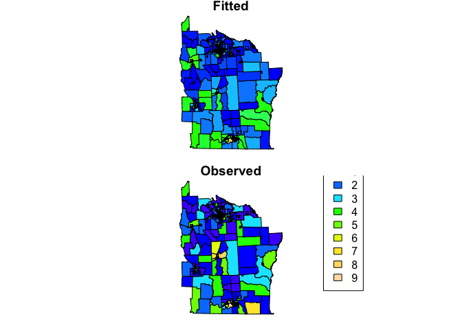
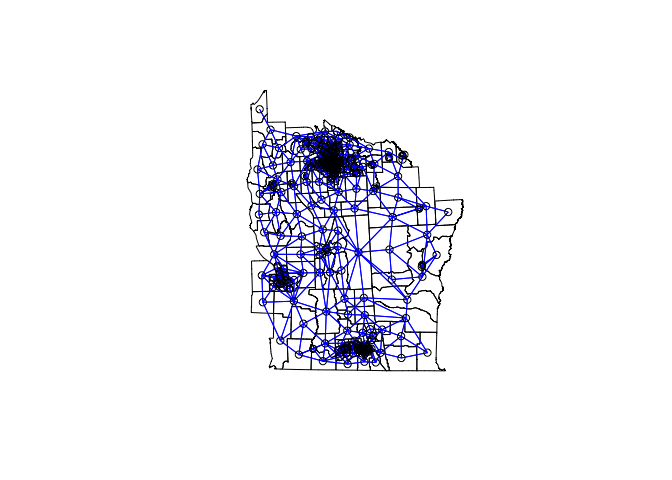
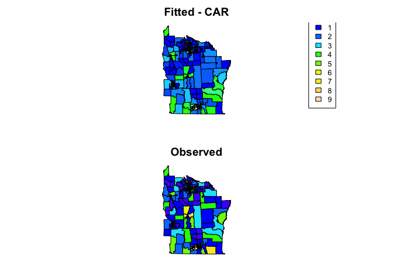

Spatial regression of areal data
================

## Week 7 - spatial regression of areal data

You now have the skills to: - map spatial data - obtain, generate and
manipulate raster data - conduct spatial interpolation - identify
clustering - fit spatial regression models to point prevalence data

This week are going to introduce 2 more topics.

1)  Modeling count data
2)  Fitting spatial models to areal (i.e. polygon) data

## Modeling count data

The malaria data in Oromia is an example of binomial data. You are also
likely to explore count data (e.g. numbers of disease cases). We can use
a similar process to model these data. Let’s look at an example of
counts recorded over areal units (i.e. polygons). These data contain
information on leukemia cases from New York (Turnbull et al 1990). We’ll
load in the shape files for New York census tracks and the locations of
hazardous waste sites as potential exposures.

First, load the libraries required for this week

``` r
library(sp)
library(ggplot2)
library(rgdal)
```

    ## rgdal: version: 1.5-12, (SVN revision 1018)
    ## Geospatial Data Abstraction Library extensions to R successfully loaded
    ## Loaded GDAL runtime: GDAL 3.1.1, released 2020/06/22
    ## Path to GDAL shared files: /Library/Frameworks/R.framework/Versions/4.0/Resources/library/rgdal/gdal
    ## GDAL binary built with GEOS: TRUE 
    ## Loaded PROJ runtime: Rel. 6.3.1, February 10th, 2020, [PJ_VERSION: 631]
    ## Path to PROJ shared files: /Library/Frameworks/R.framework/Versions/4.0/Resources/library/rgdal/proj
    ## Linking to sp version:1.4-2
    ## To mute warnings of possible GDAL/OSR exportToProj4() degradation,
    ## use options("rgdal_show_exportToProj4_warnings"="none") before loading rgdal.

``` r
library(spdep)
```

    ## Loading required package: spData

    ## To access larger datasets in this package, install the spDataLarge
    ## package with: `install.packages('spDataLarge',
    ## repos='https://nowosad.github.io/drat/', type='source')`

    ## Loading required package: sf

    ## Linking to GEOS 3.8.1, GDAL 3.1.1, PROJ 6.3.1

``` r
library(leaflet)
library(spaMM)
```

    ## Registered S3 methods overwritten by 'registry':
    ##   method               from 
    ##   print.registry_field proxy
    ##   print.registry_entry proxy

    ## spaMM (Rousset & Ferdy, 2014, version 3.3.0) is loaded.
    ## Type 'help(spaMM)' for a short introduction,
    ## 'news(package='spaMM')' for news,
    ## and 'citation(spaMM)' for proper citation.

``` r
library(viridis)
```

    ## Loading required package: viridisLite

``` r
nydata <- rgdal::readOGR("https://raw.githubusercontent.com/HughSt/HughSt.github.io/master/course_materials/week7/Lab_files/nydata.geojson")
```

    ## OGR data source with driver: GeoJSON 
    ## Source: "https://raw.githubusercontent.com/HughSt/HughSt.github.io/master/course_materials/week7/Lab_files/nydata.geojson", layer: "nydata"
    ## with 281 features
    ## It has 17 fields

``` r
# Let's look at the data
head(nydata@data)
```

    ##          AREANAME     AREAKEY        X        Y POP8 TRACTCAS  PROPCAS
    ## 0 Binghamton city 36007000100 4.069397 -67.3533 3540     3.08 0.000870
    ## 1 Binghamton city 36007000200 4.639371 -66.8619 3560     4.08 0.001146
    ## 2 Binghamton city 36007000300 5.709063 -66.9775 3739     1.09 0.000292
    ## 3 Binghamton city 36007000400 7.613831 -65.9958 2784     1.07 0.000384
    ## 4 Binghamton city 36007000500 7.315968 -67.3183 2571     3.06 0.001190
    ## 5 Binghamton city 36007000600 8.558753 -66.9344 2729     1.06 0.000388
    ##   PCTOWNHOME PCTAGE65P        Z  AVGIDIST PEXPOSURE   Cases       Xm       Ym
    ## 0  0.3277311 0.1466102  0.14197 0.2373852  3.167099 3.08284 4069.397 -67353.3
    ## 1  0.4268293 0.2351124  0.35555 0.2087413  3.038511 4.08331 4639.371 -66861.9
    ## 2  0.3377396 0.1380048 -0.58165 0.1708548  2.838229 1.08750 5709.063 -66977.5
    ## 3  0.4616048 0.1188937 -0.29634 0.1406045  2.643366 1.06515 7613.831 -65995.8
    ## 4  0.1924370 0.1415791  0.45689 0.1577753  2.758587 3.06017 7315.968 -67318.3
    ## 5  0.3651786 0.1410773 -0.28123 0.1726033  2.848411 1.06386 8558.753 -66934.4
    ##     Xshift  Yshift
    ## 0 423391.0 4661502
    ## 1 423961.0 4661993
    ## 2 425030.6 4661878
    ## 3 426935.4 4662859
    ## 4 426637.5 4661537
    ## 5 427880.3 4661921

``` r
# Let's create an incidence column
nydata$inc_per_1000 <- (nydata$Cases / nydata$POP8) * 1000
cases_pal <- colorBin(viridis(4), bins = c(0, 0.1, 0.5, 1, 8), nydata$inc_per_1000)
plot(nydata, col = cases_pal(nydata$inc_per_1000), asp = 1)
legend('bottomright', legend = c('0 - 0.1', '0.1 - 0.5', '0.5 - 1', '1 - 8'),
       fill = cases_pal(c(0, 0.1, 0.5, 1, 8)),
       title = 'Cases / 1000')
```

<!-- -->

``` r
# For more info on the dataset type ?spData::nydata
```

If we are interested in the relationship between incidence of leukemia
and proximity to hazardous waste sites, we can use a regression
framework. To model incidence, we will use a Poisson regression which is
suitable for modeling count outcomes. As we are more interested in
incidence than numbers of cases (i.e. case numbers are in part driven by
population), we can include population as an ‘offset’ term which
effectively allows us to model rates/incidence. Including population as
an offset is kind of like including population as a fixed effect in the
background. An offest should be included on the log scale as Poisson
regression works in log space. Sometimes, the ‘expected’ counts are used
in place of population. These expected counts are typically just a
scaled version of population, being the counts you would expect if the
mean incidence rate was applied to every areal unit.

Let’s try fitting a simple model using the covariates `PEXPOSURE` which
is “exposure potential” calculated as the inverse distance between each
census tract centroid and the nearest TCE site.

``` r
# First round the case numbers
nydata$CASES <- round(nydata$TRACTCAS)
nyc_glm_mod <- glm(CASES ~ PEXPOSURE + PCTOWNHOME + PCTAGE65P, offset = log(POP8), 
                     data = nydata, family = 'poisson')
summary(nyc_glm_mod)
```

    ## 
    ## Call:
    ## glm(formula = CASES ~ PEXPOSURE + PCTOWNHOME + PCTAGE65P, family = "poisson", 
    ##     data = nydata, offset = log(POP8))
    ## 
    ## Deviance Residuals: 
    ##     Min       1Q   Median       3Q      Max  
    ## -2.9119  -1.1299  -0.1773   0.6448   3.2443  
    ## 
    ## Coefficients:
    ##             Estimate Std. Error z value Pr(>|z|)    
    ## (Intercept) -8.18147    0.18581 -44.033  < 2e-16 ***
    ## PEXPOSURE    0.15259    0.03166   4.819 1.44e-06 ***
    ## PCTOWNHOME  -0.35923    0.19344  -1.857   0.0633 .  
    ## PCTAGE65P    4.04964    0.60658   6.676 2.45e-11 ***
    ## ---
    ## Signif. codes:  0 '***' 0.001 '**' 0.01 '*' 0.05 '.' 0.1 ' ' 1
    ## 
    ## (Dispersion parameter for poisson family taken to be 1)
    ## 
    ##     Null deviance: 457.66  on 280  degrees of freedom
    ## Residual deviance: 382.63  on 277  degrees of freedom
    ## AIC: 957.38
    ## 
    ## Number of Fisher Scoring iterations: 5

We can see that ‘PEXPOSURE’ is positively related to incidence, i.e. the
further from contamination sites, the lower the risk of leukemia. We can
plot fitted versus observed values.

``` r
# Scatter plot
ggplot() + geom_point(aes(nyc_glm_mod$fitted.values, nydata$CASES))
```

<!-- -->

``` r
# Create maps
nydata$fitted <- nyc_glm_mod$fitted.values

col_pal <- colorNumeric(topo.colors(64), c(0,9))
par(mfrow=c(2,1), mar=c(rep(0.8,4)))
plot(nydata, col = col_pal(nydata$fitted), asp=1, main = 'Fitted')
plot(nydata, col = col_pal(nydata$CASES), asp=1, main = 'Observed')
legend("bottomright", inset = 0.2,
       legend=0:9, fill = col_pal(0:9),
       title = 'Counts')
```

<!-- -->

However, just as covered in week 6, we are making the assumption that
the model residuals are independent. In reality, often neighbouring
values display some correlation. If present, residual spatial
autocorrelation violates the assumption made when applying GLMs. In
[Week 4]() we covered how to test for spatial autocorrelation
(clustering) using a neighbourhood matrix. Such an approach is suitable
for areal data where spatial relationships are often better modeled
using adjacencies as opposed to distances. We can apply the same
approach using our model residuals to test for residual spatial
autocorrelation of areal data.

``` r
# Contiguity neighbors - all that share a boundary point
nydata_nb <- poly2nb(nydata)  #queen contiguity
nydata_nb
```

    ## Neighbour list object:
    ## Number of regions: 281 
    ## Number of nonzero links: 1624 
    ## Percentage nonzero weights: 2.056712 
    ## Average number of links: 5.779359

``` r
# coordinates
coords<-coordinates(nydata)

#view the neighbors
plot(nydata, asp = 1)
plot(nydata_nb,coords,col="blue",add=T)
```

<!-- -->

Now we have our neighbourhood list, we can run a Conditional
Autoregessive (CAR) model, which allows us to incorporate the spatial
autocorrelation between neighbours within our GLM. To do this, we are
going to stick with the `spaMM` package. We first need to convert our
neighbourhood list to a neighbourhood (adjacency) matrix which is
required by the function. For a CAR model we have to use binary weights
(i.e. are you a neighbour 0/1)

``` r
adj_matrix <- nb2mat(nydata_nb, style="B")

# Annoyingly we have to remove the row.names, otherwise R complains later
row.names(adj_matrix) <- NULL
```

Now we can fit the model

``` r
nyc_car_mod <- fitme(CASES ~ PEXPOSURE + PCTOWNHOME + PCTAGE65P + adjacency(1|AREAKEY) +
                             offset(log(POP8)), 
                     adjMatrix = adj_matrix,
                     data = nydata@data, family = 'poisson')
```

    ## If the 'RSpectra' package were installed, an eigenvalue computation could be faster.

``` r
summary(nyc_car_mod)
```

    ## formula: CASES ~ PEXPOSURE + PCTOWNHOME + PCTAGE65P + adjacency(1 | AREAKEY) + 
    ##     offset(log(POP8))
    ## Estimation of corrPars and lambda by Laplace ML approximation (p_v).
    ## Estimation of fixed effects by Laplace ML approximation (p_v).
    ## Estimation of lambda by 'outer' ML, maximizing p_v.
    ## Family: poisson ( link = log ) 
    ##  ------------ Fixed effects (beta) ------------
    ##             Estimate Cond. SE t-value
    ## (Intercept)  -8.1955  0.20389 -40.195
    ## PEXPOSURE     0.1510  0.03444   4.386
    ## PCTOWNHOME   -0.4165  0.21228  -1.962
    ## PCTAGE65P     4.0803  0.68714   5.938
    ##  --------------- Random effects ---------------
    ## Family: gaussian ( link = identity ) 
    ##                    --- Correlation parameters:
    ##      1.rho 
    ## -0.2533568 
    ##            --- Variance parameters ('lambda'):
    ## lambda = var(u) for u ~ Gaussian; 
    ##    AREAKEY  :  0.06657  
    ## # of obs: 281; # of groups: AREAKEY, 281 
    ##  ------------- Likelihood values  -------------
    ##                         logLik
    ## p_v(h) (marginal L): -471.4893

How has the inclusion of a spatial term affected our estimates? Remeber
from week 6, that if you want to generate 95% CIs of your estimates you
can use the following code

``` r
terms <- c('PEXPOSURE', 'PCTOWNHOME', 'PCTAGE65P')
coefs <- as.data.frame(summary(nyc_car_mod)$beta_table)
```

    ## formula: CASES ~ PEXPOSURE + PCTOWNHOME + PCTAGE65P + adjacency(1 | AREAKEY) + 
    ##     offset(log(POP8))
    ## Estimation of corrPars and lambda by Laplace ML approximation (p_v).
    ## Estimation of fixed effects by Laplace ML approximation (p_v).
    ## Estimation of lambda by 'outer' ML, maximizing p_v.
    ## Family: poisson ( link = log ) 
    ##  ------------ Fixed effects (beta) ------------
    ##             Estimate Cond. SE t-value
    ## (Intercept)  -8.1955  0.20389 -40.195
    ## PEXPOSURE     0.1510  0.03444   4.386
    ## PCTOWNHOME   -0.4165  0.21228  -1.962
    ## PCTAGE65P     4.0803  0.68714   5.938
    ##  --------------- Random effects ---------------
    ## Family: gaussian ( link = identity ) 
    ##                    --- Correlation parameters:
    ##      1.rho 
    ## -0.2533568 
    ##            --- Variance parameters ('lambda'):
    ## lambda = var(u) for u ~ Gaussian; 
    ##    AREAKEY  :  0.06657  
    ## # of obs: 281; # of groups: AREAKEY, 281 
    ##  ------------- Likelihood values  -------------
    ##                         logLik
    ## p_v(h) (marginal L): -471.4893

``` r
row <- row.names(coefs) %in% terms
lower <- coefs[row,'Estimate'] - 1.96*coefs[row, 'Cond. SE']
upper <- coefs[row,'Estimate'] + 1.96*coefs[row, 'Cond. SE']
data.frame(terms = terms,
           IRR = exp(coefs[row,'Estimate']),
           lower = exp(lower),
           upper = exp(upper))
```

    ##        terms        IRR      lower       upper
    ## 1  PEXPOSURE  1.1630502  1.0871430   1.2442575
    ## 2 PCTOWNHOME  0.6593296  0.4349178   0.9995348
    ## 3  PCTAGE65P 59.1607541 15.3859459 227.4799906

We can see how well the model fits using scatter plots and maps

``` r
# Scatter plot
ggplot() + geom_point(aes(fitted(nyc_car_mod), nydata$CASES))
```

<!-- -->

``` r
# Create maps
nydata$fitted_car <- fitted(nyc_car_mod)

col_pal <- colorNumeric(topo.colors(64), c(0,9))
par(mfrow=c(2,1), mar=rep(2,4))
plot(nydata, col = col_pal(nydata$fitted_car), asp=1, main = 'Fitted - CAR')
legend("bottomright", inset = 0.1, cex = 0.8,
       legend=0:9, fill = col_pal(0:9),
       title = 'Counts')
plot(nydata, col = col_pal(nydata$CASES), asp=1, main = 'Observed')
```

<!-- -->

### References

#### Citation for the leukemia data

Turnbull, B. W. et al (1990) Monitoring for clusters of disease:
application to leukemia incidence in upstate New York American Journal
of Epidemiology, 132, 136–143

#### Key reading

Bivand R, Pebesma E, Gomez-Rubio V. (2013). Applied Spatial Data
Analysis with R. Use R\! Springer: New York (particularly chapter 9 on
areal data)

#### Other resources

S. Banerjee, B.P. Carlin and A.E. Gelfand (2003). Hierarchical Modeling
and Analysis for Spatial Data. Chapman & Hall.

D.J. Spiegelhalter, N.G. Best, B.P. Carlin and A. Van der Linde (2002).
Bayesian Measures of Model Complexity and Fit (with Discussion), Journal
of the Royal Statistical Society, Series B 64(4), 583-616.

L.A. Waller and C.A. Gotway (2004). Applied Spatial Statistics for
Public Health Data. Wiley & Sons.

### Assignment

1.  Load the [Scottish Lip Cancer
    dataset](https://raw.githubusercontent.com/HughSt/HughSt.github.io/master/course_materials/week7/assignment/scotlip.geojson)

<!-- end list -->

``` r
scotlip <- readOGR('https://raw.githubusercontent.com/HughSt/HughSt.github.io/master/course_materials/week7/assignment/scotlip.geojson')
```

    ## OGR data source with driver: GeoJSON 
    ## Source: "https://raw.githubusercontent.com/HughSt/HughSt.github.io/master/course_materials/week7/assignment/scotlip.geojson", layer: "scotlip"
    ## with 56 features
    ## It has 6 fields

This file contains data on numbers of lip cancer cases in Scotland from
1975 - 1986. It contains the following fields \* ID = ID of the county
\* county.names = County name \* cases = Number of cases \* expected =
Expected number of cases if risk/incidence were equal over every county
\* AFF = Proportion of the population involved in fishing, forestry or
agriculture \* SMR = cases / expected

1.  Test for spatial autocorrelation - you should know how to do this

2.  Compare a spatial model to a non-spatial model - which is better and
    why?

3.  Is the effect of AFF the same in both models? What is your
    interpretation of this covariate in the best model?

4.  Run a spatial model and plot/map the fitted compared to the observed
