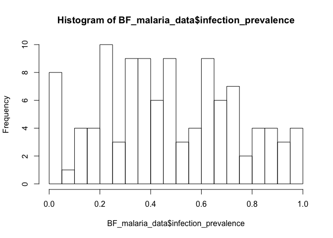
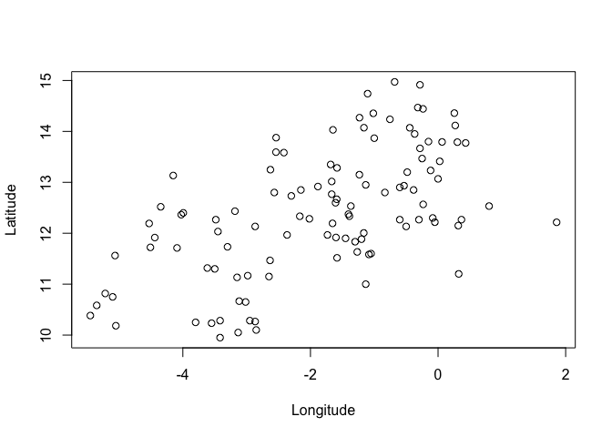
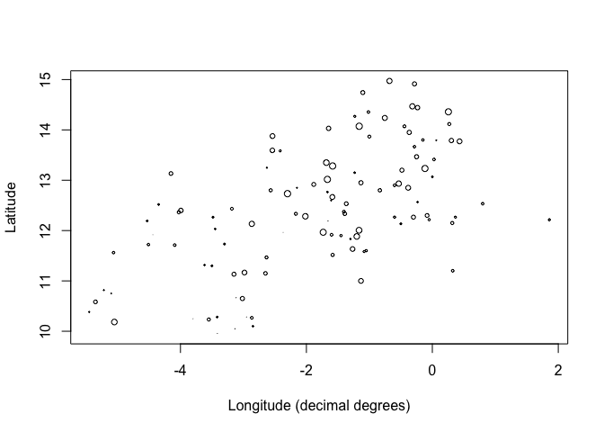

Untitled
================

Lab 1: Working with Spatial Data in R
=====================================

Normally this type of analysis deals with three types of files: shapefiles, geojson, or tables with coordinates

Start by ensuring the following packages are loaded

``` r
library(sp)
library(raster)
```

    ## Warning: package 'raster' was built under R version 3.5.2

``` r
library(rgdal)
```

    ## rgdal: version: 1.3-6, (SVN revision 773)
    ##  Geospatial Data Abstraction Library extensions to R successfully loaded
    ##  Loaded GDAL runtime: GDAL 2.1.3, released 2017/20/01
    ##  Path to GDAL shared files: /Library/Frameworks/R.framework/Versions/3.5/Resources/library/rgdal/gdal
    ##  GDAL binary built with GEOS: FALSE 
    ##  Loaded PROJ.4 runtime: Rel. 4.9.3, 15 August 2016, [PJ_VERSION: 493]
    ##  Path to PROJ.4 shared files: /Library/Frameworks/R.framework/Versions/3.5/Resources/library/rgdal/proj
    ##  Linking to sp version: 1.3-1

The simplest data is a table with coordinates (i.e. point data). For this assignment, we'll work with malaria prevalence point data from Burkina Faso.

Import the data

``` r
BF_malaria_data <- read.csv("https://raw.githubusercontent.com/HughSt/HughSt.github.io/master/course_materials/week1/Lab_files/Data/BF_malaria_data.csv",
                            header=T)
```

The columns should be self-explanatory, but briefly: - examined = numbers tested - positives = of those tested, how many were positive for malaria - longitude = longitude in decimal degrees - latitude = latitude in decimal degrees

``` r
head(BF_malaria_data) # gives you the first few rows
```

    ##   X examined positives longitude latitude
    ## 1 1      998       153  -5.45000 10.38333
    ## 2 2      459       262  -5.35000 10.58333
    ## 3 3      595        72  -5.21667 10.81667
    ## 4 4      883        81  -5.10000 10.75000
    ## 5 5      456       170  -5.06270 11.56180
    ## 6 6      304       264  -5.05000 10.18333

``` r
names(BF_malaria_data) # gives you the column names
```

    ## [1] "X"         "examined"  "positives" "longitude" "latitude"

``` r
# If you want to create a new variable, you can use the $ sign
#Example: Prevalence
BF_malaria_data$infection_prevalence <- BF_malaria_data$positives / BF_malaria_data$examined

#Create a histogram of the prevalence
hist(BF_malaria_data$infection_prevalence, breaks=20)
```



``` r
# Use R's basic plotting function to plot 
plot(BF_malaria_data$longitude, BF_malaria_data$latitude,
     ylab = "Latitude", xlab="Longitude") #boring!
```



``` r
# Use the cex function to plot circle size as a function of a variable
plot(BF_malaria_data$longitude, BF_malaria_data$latitude, 
     cex=BF_malaria_data$infection_prevalence,
     ylab = "Latitude", xlab="Longitude (decimal degrees)")
```


